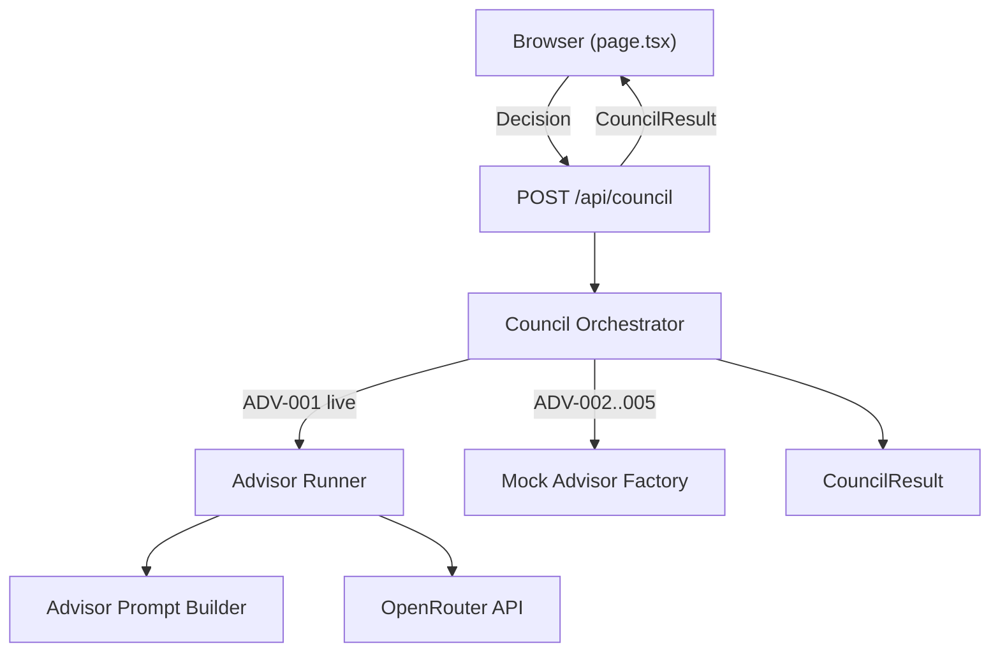

# Prodignus Decision Council

A hybrid decision-support application where five advisor personas challenge a decision before a Chairman consolidates a recommendation.

## Getting Started

1. Install dependencies:

```bash
npm install
```

2. Create `.env.local` from the example:

```bash
cp .env.example .env.local
```

3. Set your OpenRouter credentials in `.env.local`:

```env
OPENROUTER_API_KEY=your_key_here
OPENROUTER_MODEL_CONTRARIAN=anthropic/claude-3.5-sonnet
```

4. Run the development server:

```bash
npm run dev
```

Open [http://localhost:3000](http://localhost:3000).

## Sprint 3 Architecture

Sprint 3 refactors the Council into a server-side orchestration layer. The browser submits a `Decision` and receives a fully assembled `CouncilResult`.

### Request flow



### Key components

| Component | Location | Role |
|-----------|----------|------|
| Primary API | `src/app/api/council/route.ts` | Validates input, invokes orchestrator, returns structured JSON |
| Orchestrator | `src/lib/council/orchestrator.ts` | Runs live and mock advisors, attaches Chairman, computes session status |
| Advisor Runner | `src/lib/council/advisor-runner.ts` | Generic live advisor execution via OpenRouter |
| Prompt Builder | `src/lib/council/advisor-prompt.ts` | Builds prompts from `AdvisorPersona` and thinking lens |
| Mock Factory | `src/data/mock-council-result.ts` | Returns fresh prototype advisor and Chairman results |
| OpenRouter Client | `src/lib/openrouter/client.ts` | Persona-agnostic, non-streaming chat completions |

### Hybrid execution mode

- **ADV-001 (The Contrarian)** — live OpenRouter model via `OPENROUTER_MODEL_CONTRARIAN`
- **ADV-002 to ADV-005** — static prototype mocks
- **Chairman** — static prototype mock (does not analyze live advisor output)

Configuration lives in `src/config/council.ts` (non-secret metadata only). Model environment variable mapping is server-only in `src/lib/council/advisor-execution-config.ts`.

### Error behavior

- **Invalid request** → HTTP 400, `ok: false`, no `CouncilResult`
- **Live advisor provider failure** → HTTP 200, `ok: true`, partial `CouncilResult` with failed ADV-001 and successful mocks
- **Orchestrator crash** → HTTP 500, `ok: false`

### Environment variables

| Variable | Required | Purpose |
|----------|----------|---------|
| `OPENROUTER_API_KEY` | Yes (for live advisor) | OpenRouter authentication |
| `OPENROUTER_MODEL_CONTRARIAN` | Yes (for live advisor) | Model ID for ADV-001 |

`.env.local` is git-ignored. Never commit secrets.

### Scripts

```bash
npm run dev      # Development server
npm run build    # Production build
npm run lint     # ESLint
npm run test     # Lightweight council status unit tests
```

### Limitations

- No persistence, authentication, streaming, retries, or peer review
- Only one live advisor (ADV-001)
- Chairman remains a static prototype
- No user-selectable models

## Learn More

- [Next.js Documentation](https://nextjs.org/docs)
- [OpenRouter API](https://openrouter.ai/docs)
