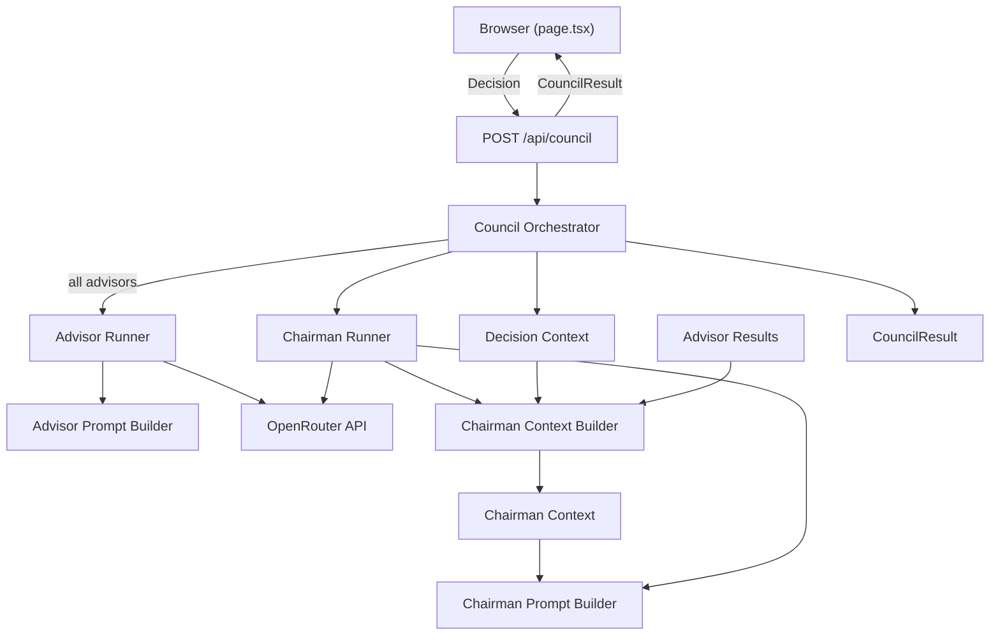

# Prodignus Decision Council

A decision-support application where five advisor personas challenge a decision before a Chairman consolidates a recommendation.

## Getting Started

1. Install dependencies:

```bash
npm install
```

2. Create `.env.local` from the example:

```bash
cp .env.example .env.local
```

3. Set your OpenRouter credentials in `.env.local`:

```env
OPENROUTER_API_KEY=your_key_here
OPENROUTER_MODEL_CONTRARIAN=anthropic/claude-3.5-sonnet
OPENROUTER_MODEL_PRODUCT_STRATEGY=anthropic/claude-3.5-sonnet
OPENROUTER_MODEL_UX_ACCESSIBILITY=anthropic/claude-3.5-sonnet
OPENROUTER_MODEL_DELIVERY_ENGINEERING=anthropic/claude-3.5-sonnet
OPENROUTER_MODEL_HUMAN_IMPACT=anthropic/claude-3.5-sonnet
OPENROUTER_MODEL_CHAIRMAN=anthropic/claude-3.5-sonnet
```

4. Run the development server:

```bash
npm run dev
```

Open [http://localhost:3000](http://localhost:3000).

## Decision Context Invariant

Every Council execution creates exactly one immutable `DecisionContext` shared by all Advisors and the Chairman.

The orchestrator builds this context once per request. Every advisor runner and the chairman runner receive the same:

- execution ID
- question
- language
- context, objectives, and constraints
- attachments (future-ready)

Only the advisor perspective (persona and thinking lens) may differ between advisors.

## Documentation

Engineering documentation follows the [OPS-0001 — Engineering Workflow Standard](docs/ops/OPS-0001-engineering-workflow-standard.md).

See the [documentation index](docs/README.md) for ADRs, engineering specifications, architecture readiness reviews, architecture assessments, implementation plans, architecture implementation reviews, completion reports, and related governance artifacts.

Sprint 6 governance chain: [ADR-0003](docs/adr/ADR-0003-collective-intelligence-layer.md) → [ENG-0002](docs/eng/ENG-0002-chairman-context-builder-technical-specification.md) → [ARR-0001](docs/arr/ARR-0001-architecture-readiness-review.md) → [IMP-0002](docs/imp/IMP-0002-chairman-context-builder-implementation-plan.md) → [AIR-0001](docs/air/AIR-0001-chairman-context-builder-architecture-implementation-review.md) → [ICR-0002](docs/icr/ICR-0002-chairman-context-builder-implementation-completion-report.md).

## Architecture

The browser submits a `Decision` and receives a fully assembled `CouncilResult`.

### Request flow



### Key components

| Component | Location | Role |
|-----------|----------|------|
| Primary API | `src/app/api/council/route.ts` | Validates input, invokes orchestrator, returns structured JSON |
| Decision Context | `src/lib/council/decision-context.ts` | Creates immutable shared execution context and integrity diagnostics |
| Orchestrator | `src/lib/council/orchestrator.ts` | Creates one Decision Context, runs all advisors, invokes Chairman |
| Advisor Runner | `src/lib/council/advisor-runner.ts` | Generic live advisor execution via OpenRouter |
| Chairman Context Builder | `src/lib/council/chairman-context-builder.ts` | Builds structured `ChairmanContext` from `DecisionContext` and advisor results |
| Chairman Context Types | `src/lib/council/chairman-context.types.ts` | Versioned Chairman context contract and build input |
| Chairman Runner | `src/lib/council/chairman-runner.ts` | Builds Chairman context, synthesizes advisor outputs via OpenRouter |
| Prompt Builder | `src/lib/council/advisor-prompt.ts` | Builds prompts from shared Decision Context and advisor persona |
| Chairman Prompt | `src/lib/council/chairman-prompt.ts` | Builds Chairman synthesis prompt from `ChairmanContext` |
| OpenRouter Client | `src/lib/openrouter/client.ts` | Persona-agnostic, non-streaming chat completions |

### Live execution mode

- **ADV-001 (The Contrarian)** — live OpenRouter model via `OPENROUTER_MODEL_CONTRARIAN`
- **ADV-002 (The Product Strategy Advisor)** — dedicated product strategy prompt and parser via `OPENROUTER_MODEL_PRODUCT_STRATEGY`
- **ADV-003 (The UX & Accessibility Advisor)** — dedicated UX and accessibility prompt and parser via `OPENROUTER_MODEL_UX_ACCESSIBILITY`
- **ADV-004 (The Delivery Engineering Advisor)** — dedicated delivery engineering prompt and parser via `OPENROUTER_MODEL_DELIVERY_ENGINEERING`
- **ADV-005 (The Human Impact Advisor)** — dedicated human impact prompt and parser via `OPENROUTER_MODEL_HUMAN_IMPACT`
- **Chairman** — live OpenRouter model via `OPENROUTER_MODEL_CHAIRMAN`

Configuration lives in `src/config/council.ts` (non-secret metadata only). Model environment variable mapping is server-only in `src/lib/council/advisor-execution-config.ts` and `src/lib/council/chairman-execution-config.ts`.

### Error behavior

- **Invalid request** → HTTP 400, `ok: false`, no `CouncilResult`
- **Advisor or Chairman provider failure** → HTTP 200, `ok: true`, partial `CouncilResult` with failed participants recorded explicitly
- **Orchestrator crash** → HTTP 500, `ok: false`

### Environment variables

| Variable | Required | Purpose |
|----------|----------|---------|
| `OPENROUTER_API_KEY` | Yes | OpenRouter authentication |
| `OPENROUTER_MODEL_CONTRARIAN` | Yes | Model ID for ADV-001 |
| `OPENROUTER_MODEL_PRODUCT_STRATEGY` | Yes | Model ID for ADV-002 (Product Strategy Advisor) |
| `OPENROUTER_MODEL_UX_ACCESSIBILITY` | Yes | Model ID for ADV-003 (UX & Accessibility Advisor) |
| `OPENROUTER_MODEL_DELIVERY_ENGINEERING` | Yes | Model ID for ADV-004 (Delivery Engineering Advisor) |
| `OPENROUTER_MODEL_HUMAN_IMPACT` | Yes | Model ID for ADV-005 (Human Impact Advisor) |
| `OPENROUTER_MODEL_CHAIRMAN` | Yes | Model ID for Chairman synthesis |

`.env.local` is git-ignored. Never commit secrets.

### Scripts

```bash
npm run dev      # Development server
npm run build    # Production build
npm run lint     # ESLint
npm run test     # Council integrity, chairman, and orchestration tests
```

### Limitations

- No persistence, authentication, streaming, retries, or peer review
- All advisors require configured OpenRouter models
- Chairman depends on available advisor outputs; synthesis quality varies when advisors fail
- No user-selectable models
- Attachments are modeled but not yet implemented

## Learn More

- [Next.js Documentation](https://nextjs.org/docs)
- [OpenRouter API](https://openrouter.ai/docs)
