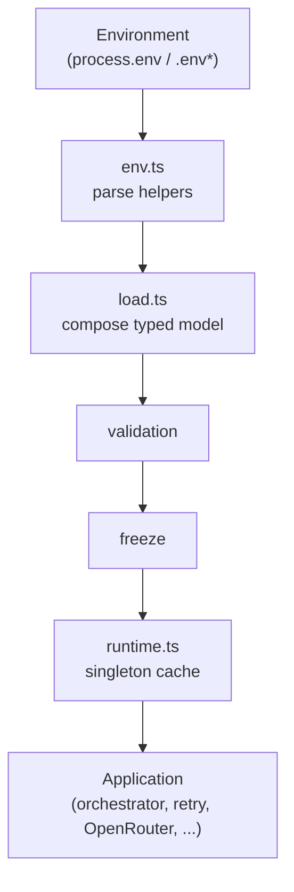

# Runtime Configuration Architecture

**Status:** Informative (WP-07 Configuration Slice)  
**Scope:** Decision Council operational runtime configuration  
**Governing references:** IMP-0001, ARR-0004, WP-07 Configuration Slice  

This document describes the runtime configuration layer introduced by the WP-07 Configuration Slice. It does not authorize implementation changes, hot reload, or dynamic configuration.

---

## Purpose

Runtime configuration exists so that **operational behavior** of the Decision Council is controlled from a single, typed, validated source of truth—rather than from magic numbers and duplicated constants spread across OpenRouter, retry, advisor, and chairman modules.

WP-07 externalizes knobs such as retry budget, timeouts, advisor enablement/order/concurrency, chairman thresholds, OpenRouter tuning, and feature flags **without changing business logic**. Defaults preserve pre–WP-07 behavior.

---

## Goals

| Goal | Description |
| ---- | ----------- |
| Centralized operational configuration | One typed model (`RuntimeCouncilConfig`) for operational knobs |
| Immutable after load | Configuration is frozen and cached for the process lifetime |
| Fail-fast validation | Invalid environment values throw `RuntimeConfigError` at load time |
| Environment overrides | Process environment (e.g. `.env.local`) overrides defaults |
| Behavior-preserving defaults | Unset variables retain historical Decision Council behavior |
| Typed configuration | TypeScript types define structure and intended ranges |

---

## Architecture

Configuration is implemented under [`src/config/`](../../src/config/).

| Module | Role |
| ------ | ---- |
| [`types.ts`](../../src/config/types.ts) | Typed model and `RuntimeConfigError` |
| [`defaults.ts`](../../src/config/defaults.ts) | Behavior-preserving defaults |
| [`env.ts`](../../src/config/env.ts) | Environment parsers (string, number, boolean, lists, categories) |
| [`load.ts`](../../src/config/load.ts) | Compose, validate, freeze |
| [`runtime.ts`](../../src/config/runtime.ts) | Process-wide singleton (`getRuntimeConfig()`) |
| [`council.ts`](../../src/config/council.ts) | Application **metadata** only (not operational knobs) |
| [`index.ts`](../../src/config/index.ts) | Public re-exports |

Consumers obtain configuration via `getRuntimeConfig()` (or thin getters that read it). Restart the process to pick up environment changes.

---

## Configuration hierarchy

### Retry

| | |
| -- | -- |
| **Purpose** | Bound provider retry attempts, delay/backoff, eligible failure categories, and a master enable switch |
| **Default behavior** | `maxAttempts = 3`, `baseDelayMs = 0` (immediate retries), multiplier `2`, `maxDelayMs = 30000`, categories `timeout,rate_limited,transient,invalid_response`, `enabled = true` |
| **Override** | `COUNCIL_RETRY_*` environment variables |

### Timeouts

| | |
| -- | -- |
| **Purpose** | Per-request advisor and chairman provider timeouts; optional overall council wall-clock budget |
| **Default behavior** | Advisor and chairman `90000` ms; overall `0` (disabled — current behavior) |
| **Override** | `COUNCIL_ADVISOR_TIMEOUT_MS`, `COUNCIL_CHAIRMAN_TIMEOUT_MS`, `COUNCIL_OVERALL_TIMEOUT_MS`. If council-specific timeouts are unset, `OPENROUTER_REQUEST_TIMEOUT_MS` is used as a fallback for advisor and chairman timeouts |

### Advisors

| | |
| -- | -- |
| **Purpose** | Which advisors run, in what order, and with what concurrency limit |
| **Default behavior** | All five live advisors (`ADV-001`…`ADV-005`) enabled; same execution order; `maxConcurrency = 5` |
| **Override** | `COUNCIL_ENABLED_ADVISORS`, `COUNCIL_ADVISOR_EXECUTION_ORDER`, `COUNCIL_ADVISOR_MAX_CONCURRENCY` (comma-separated advisor IDs where applicable) |

### Chairman

| | |
| -- | -- |
| **Purpose** | Whether Chairman runs, minimum successful advisors for synthesis, complete-session threshold, and reserved invented-content flag |
| **Default behavior** | Enabled; minimum `3`; complete threshold `4`; `allowInventedAdvisorContent = false` |
| **Override** | `COUNCIL_CHAIRMAN_ENABLED`, `COUNCIL_MIN_SUCCESSFUL_ADVISORS`, `COUNCIL_COMPLETE_ADVISOR_THRESHOLD`, `COUNCIL_ALLOW_INVENTED_ADVISOR_CONTENT` |

### OpenRouter

| | |
| -- | -- |
| **Purpose** | Centralize API URL, default temperature, optional max tokens, HTTP referer, and **names** of model environment variables |
| **Default behavior** | OpenRouter chat completions URL; temperature `0.3`; `maxTokens = 0` (omit `max_tokens` from request); referer `http://localhost:3000`; fixed model env var name map (unchanged from pre–WP-07) |
| **Override** | `OPENROUTER_API_URL`, `OPENROUTER_DEFAULT_TEMPERATURE`, `OPENROUTER_MAX_TOKENS`, `OPENROUTER_HTTP_REFERER`. Actual model IDs continue to come from existing `OPENROUTER_MODEL_*` variables in `.env` / `.env.local` |

### Feature Flags

| | |
| -- | -- |
| **Purpose** | Typed switches for logging/diagnostics-related behavior defaults |
| **Default behavior** | Structured logging on; detailed traces off; provider diagnostics on; retry metrics off |
| **Override** | `COUNCIL_FEATURE_*` environment variables |

Observability *implementation* (metrics, dashboards, streaming) remains out of scope for the Configuration Slice and is deferred to the WP-07 Observability Slice.

---

## Startup lifecycle

1. **Read environment** — `loadRuntimeConfig(env)` reads `process.env` (or a test-supplied env object).
2. **Parse** — [`env.ts`](../../src/config/env.ts) helpers coerce strings to numbers, booleans, advisor ID lists, and retry categories.
3. **Validate** — Structural and range checks run in [`load.ts`](../../src/config/load.ts) (`validateConfig`). Unknown advisor IDs and invalid enums fail here or during parse.
4. **Build typed model** — A `RuntimeCouncilConfig` object is assembled from defaults + overrides.
5. **Freeze** — Nested objects and arrays are `Object.freeze`d to prevent mutation.
6. **Expose singleton** — First call to `getRuntimeConfig()` caches the frozen config for the process. Subsequent calls return the same instance.

There is **no** hot reload and **no** mid-session reconfiguration in the current architecture.

---

## Validation

### Invalid values

Examples that throw `RuntimeConfigError`:

- Non-numeric values for numeric variables
- Numbers outside declared min/max (e.g. temperature outside `0…2`, `maxAttempts < 1`)
- Invalid booleans (values other than truthy/falsy tokens: `1`/`true`/`yes`/`on` and `0`/`false`/`no`/`off`)
- Unknown retry categories or empty category lists
- Unknown advisor IDs or empty advisor lists
- Enabled advisor missing from execution order
- `completeAdvisorThreshold < minimumSuccessfulAdvisors`

### Startup failures

Invalid configuration fails when configuration is first loaded (typically first `getRuntimeConfig()` access during request handling or tests). The process does not silently adopt unsafe operational settings.

### Fallback rules

| Condition | Behavior |
| --------- | -------- |
| Variable unset or blank | Use `DEFAULT_RUNTIME_CONFIG` value |
| `COUNCIL_*_TIMEOUT_MS` unset | Fall back to `OPENROUTER_REQUEST_TIMEOUT_MS` if set; else default `90000` |
| `OPENROUTER_API_URL` / `OPENROUTER_HTTP_REFERER` unset | Use defaults |
| `OPENROUTER_MAX_TOKENS = 0` | Do not send `max_tokens` (provider default) |
| Invalid value present | **No** silent fallback — throw `RuntimeConfigError` |

---

## Runtime principles

- **Immutable after startup** — Frozen nested structure; singleton cache.
- **No runtime mutation** — Application code must not reassign operational knobs on the live config object.
- **Deterministic behavior** — Same environment ⇒ same validated configuration for every session in that process.
- **Fail-fast philosophy** — Prefer startup/load failure over ambiguous or partial configuration.
- **Restart to apply changes** — Environment edits require a process restart.

---

## Environment variables

Variables introduced or centralized by the WP-07 Configuration Slice for runtime operational control:

| Variable | Type | Default | Description |
| -------- | ---- | ------- | ----------- |
| `COUNCIL_RETRY_MAX_ATTEMPTS` | integer ≥ 1 | `3` | Max attempts including the initial try |
| `COUNCIL_RETRY_BASE_DELAY_MS` | integer ≥ 0 | `0` | Base delay before first retry (`0` = immediate) |
| `COUNCIL_RETRY_BACKOFF_MULTIPLIER` | number ≥ 1 | `2` | Exponential backoff multiplier |
| `COUNCIL_RETRY_MAX_DELAY_MS` | integer ≥ 0 | `30000` | Cap on computed retry delay |
| `COUNCIL_RETRY_CATEGORIES` | CSV categories | `timeout,rate_limited,transient,invalid_response` | Retry-eligible failure categories |
| `COUNCIL_RETRY_ENABLED` | boolean | `true` | Master switch for provider retries |
| `COUNCIL_ADVISOR_TIMEOUT_MS` | integer ≥ 1 | `90000`† | Advisor provider request timeout (ms) |
| `COUNCIL_CHAIRMAN_TIMEOUT_MS` | integer ≥ 1 | `90000`† | Chairman provider request timeout (ms) |
| `COUNCIL_OVERALL_TIMEOUT_MS` | integer ≥ 0 | `0` | Whole-session budget; `0` disables |
| `COUNCIL_ENABLED_ADVISORS` | CSV advisor IDs | `ADV-001,…,ADV-005` | Advisors allowed to run |
| `COUNCIL_ADVISOR_EXECUTION_ORDER` | CSV advisor IDs | `ADV-001,…,ADV-005` | Preferred execution order |
| `COUNCIL_ADVISOR_MAX_CONCURRENCY` | integer ≥ 1 | `5` | Max concurrent advisor executions |
| `COUNCIL_CHAIRMAN_ENABLED` | boolean | `true` | Whether Chairman synthesis runs |
| `COUNCIL_MIN_SUCCESSFUL_ADVISORS` | integer ≥ 1 | `3` | Minimum successes for synthesis / session rules |
| `COUNCIL_COMPLETE_ADVISOR_THRESHOLD` | integer ≥ min | `4` | Threshold for “complete” session status |
| `COUNCIL_ALLOW_INVENTED_ADVISOR_CONTENT` | boolean | `false` | Reserved fallback flag (current behavior does not invent advisors) |
| `OPENROUTER_API_URL` | string | OpenRouter chat completions URL | Provider endpoint |
| `OPENROUTER_DEFAULT_TEMPERATURE` | number 0–2 | `0.3` | Default request temperature |
| `OPENROUTER_MAX_TOKENS` | integer ≥ 0 | `0` | Max tokens; `0` omits field |
| `OPENROUTER_HTTP_REFERER` | string | `http://localhost:3000` | `HTTP-Referer` header value |
| `OPENROUTER_REQUEST_TIMEOUT_MS` | integer ≥ 1 | `90000` | Legacy shared timeout fallback for advisor/chairman when council-specific vars unset |
| `COUNCIL_FEATURE_STRUCTURED_LOGGING` | boolean | `true` | Feature flag: structured logging |
| `COUNCIL_FEATURE_DETAILED_TRACES` | boolean | `false` | Feature flag: detailed traces |
| `COUNCIL_FEATURE_PROVIDER_DIAGNOSTICS` | boolean | `true` | Feature flag: provider diagnostics |
| `COUNCIL_FEATURE_RETRY_METRICS` | boolean | `false` | Feature flag: retry metrics (telemetry deferred) |

† Effective default when neither the council-specific variable nor `OPENROUTER_REQUEST_TIMEOUT_MS` is set.

### Related secrets and model mapping (not structural overrides)

These remain environment-supplied secrets / model IDs. Model **variable names** are fixed in defaults; values are read at call time from the environment:

| Variable | Belongs in |
| -------- | ---------- |
| `OPENROUTER_API_KEY` | `.env` / secrets |
| `OPENROUTER_MODEL_CONTRARIAN` | `.env` (ADV-001) |
| `OPENROUTER_MODEL_PRODUCT_STRATEGY` | `.env` (ADV-002) |
| `OPENROUTER_MODEL_UX_ACCESSIBILITY` | `.env` (ADV-003) |
| `OPENROUTER_MODEL_DELIVERY_ENGINEERING` | `.env` (ADV-004) |
| `OPENROUTER_MODEL_HUMAN_IMPACT` | `.env` (ADV-005) |
| `OPENROUTER_MODEL_CHAIRMAN` | `.env` (Chairman) |

See also [`.env.example`](../../.env.example).

---

## Current ownership

| Belongs in | Examples |
| ---------- | -------- |
| **Runtime configuration** (`src/config`, `getRuntimeConfig()`) | Retry budget, timeouts, advisor enablement/order/concurrency, chairman thresholds/flags, OpenRouter tuning defaults, feature flags |
| **`.env` / `.env.local` / secrets** | API keys, concrete model IDs, deployment-specific overrides of runtime variables |
| **Source code** | Business logic, prompts, parsers, persona definitions, application metadata in `council.ts` (name, version, disclaimer), algorithm semantics |

Operational knobs must not be reintroduced as magic numbers in runners or the OpenRouter client when a runtime config field already exists.

---

## Future Considerations (Non-Normative)

> **Outside IMP-0001.** The items below are architectural notes only. They are **not** authorized work under IMP-0001, ARR-0004 sequencing, or the WP-07 Configuration Slice. They must not be treated as implementation requirements.

| Consideration | Notes |
| ------------- | ----- |
| Configuration schema versioning | Future evolution may need an explicit schema version for compatibility checks |
| Compatibility strategy | Rules for reading older env shapes or migrating defaults across releases |
| Configuration lifecycle management | Formal ownership, change control, and review of operational defaults |
| Runtime reload | **Explicitly deferred** — current design requires process restart |
| Dynamic configuration | **Explicitly deferred** — no mid-session or remote dynamic config store |

Admin UI configuration, remote config services, and related product surfaces are **not** in scope for this document.

---

## Related documents

- [Documentation index](../README.md)
- [`.env.example`](../../.env.example)
- Source: [`src/config/`](../../src/config/)
