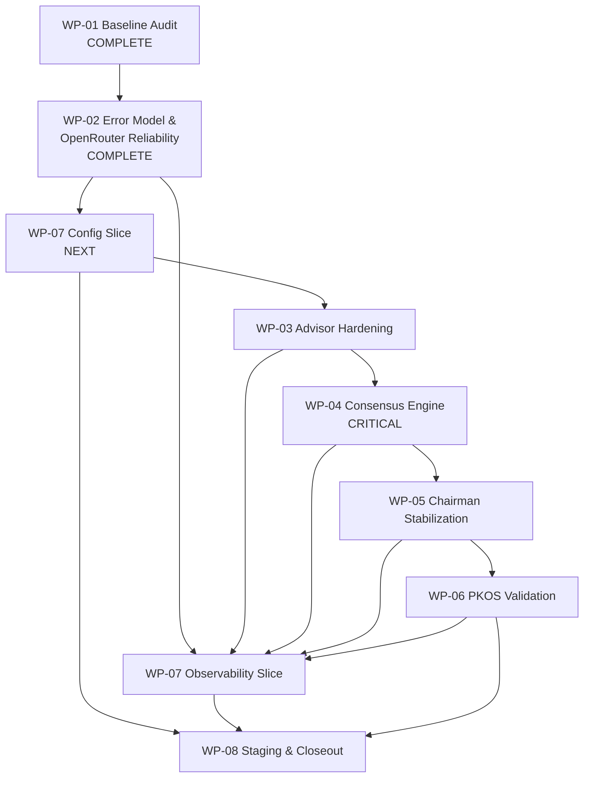

# Executive Program Review

## Document Control

| Field | Value |
|-------|-------|
| Title | ARR-0004 — Executive Program Review (IMP-0001 Remaining Roadmap) |
| Repository | `prodignus-council` |
| Branch | `master` @ `865fa83` (aligned with `origin/master`) |
| Review date | 2026-07-27 |
| Reviewer | PEOS Executive / Chief Architect review (advisory) |
| Governing documents | IMP-0000; IMP-0001; ENG-0003; ENG-0004; ADR-0002, ADR-0006, ADR-0007; ADR-0008 (Proposed — guidance); WP-01 Stage A/B; WP-02 Scope Verification, Implementation Report, Architecture Compliance Review |
| Nature | **Advisory only** — does not amend IMP-0001, ADRs, or ENGs |
| Authority | Does **not** authorize Staging, Production, release, or new work packages |

---

## Executive Summary

WP-01 (baseline + gap analysis) and WP-02 (Error Model & OpenRouter Reliability) are **complete, published, and architecture-reviewed** (`PASS WITH OBSERVATIONS`). The Decision Council remains a **credible working system** with strengthened provider retry policy, sanitized errors, and explicit session severity — but it is **not** production-ready under IMP-0001.

The single largest remaining architectural deficit is unchanged: **no deterministic Consensus Engine** (GAP-01 / ADR-0006). Observability remains **immature** (GAP-02/03). Reliability knobs introduced by WP-02 still lack **configuration externalization and backoff** (GAP-04/12 remainder → WP-07 config).

**Knowing what we know after WP-02, the optimal path is the Stage B refined sequence — not the naive linear reading of IMP-0001 WP-03→WP-07:**

```text
WP-07 config slice → WP-03 → WP-04 (★) → WP-05 → WP-06 → WP-07 obs slice (★) → WP-08
```

This preserves all IMP work-package IDs and intents. It does **not** require a major IMP rewrite. It **does** require conscious sequencing discipline already endorsed by Stage B and reinforced by WP-02 leftovers (AR-001…003 → WP-07).

**Final recommendation:** **Proceed with minor roadmap adjustments** (execute Stage B refined sequence; absorb non-blocking WP-02 AR follow-ups into planned WPs).

---

## Current Program Status

| Item | Status |
|------|--------|
| IMP-0001 | Approved; Production deploy out of scope; Staging readiness is IMP closeout target |
| WP-01 | **Complete** — Stage A + Stage B published on `master` |
| WP-02 | **Complete** — four implementation/evidence commits + ACR `PASS WITH OBSERVATIONS`; published |
| WP-03…WP-08 | **Not started** (implementation) |
| Application tip | Live five-advisor + Chairman + PKOS CRE + centralized retry + terminal severity |
| Test baseline | 273 automated tests passing at last WP-02 validation |
| Staging authorization | **Not granted** |
| WP-08 authorization | **Not satisfied** |
| Production Authorization | **Not in IMP-0001 scope** |

Verified signals (code, not docs alone):

- `src/lib/retry/` exists and is consumed by OpenRouter adapter.
- `terminal-outcome.ts` + additive API session fields exist.
- No dedicated Consensus Engine module; “consensus” remains Chairman LLM fields + session-status heuristics; `collectiveIntelligence` remains a stub concern (GAP-21).
- Observability remains console/`executionId`-centric; no metrics backend.

---

## Implementation Maturity

| Domain | Maturity | Evidence |
|--------|----------|----------|
| Architecture | **Developing** | Modular ADR-aligned baseline; Critical consensus gap; provider isolation preserved |
| Governance | **Ready** (for Phase 2 execution) | PEOS IMP/WP discipline proven on WP-02; assessments published |
| Implementation | **Developing** | WP-02 foundation landed; core production qualities incomplete |
| Testing | **Developing** | Strong unit/integration; missing route envelope, soak, Staging fixtures (GAP-17; WP02-AR-006) |
| Observability | **Early** | Console logs; no NFR-OBS-01 stage events/metrics |
| Deployment readiness | **Early** | App builds/runs; no Staging deploy evidence; no Release Engineering Staging gate closed |

**Overall program maturity:** **Developing** — past prototype chaos; not yet Staging-ready institutional system.

---

## Remaining Roadmap Assessment

| WP | Purpose | Dependency | Priority | Risk | Recommendation |
|----|---------|------------|----------|------|----------------|
| **WP-03** Advisor Orchestration Hardening | Per-advisor timeout; validation gate; confidence normalization; hang/budget hooks (GAP-05/06/16/25) | WP-02; **should follow WP-07 config slice** | **Critical Path** (enabler for WP-04) | Medium — timeout semantics / cost | Execute after config slice; do not hardcode new knobs |
| **WP-04** Consensus Hardening | Deterministic consensus engine; conflict/insufficient/minority; replace empty CI stub (GAP-01/21) | WP-03 | **Critical Path** | High complexity / Medium delivery risk (scope creep into full ENG-0003 analysis layer) | Keep **distinct**; do not merge into WP-05; IMP-bound only |
| **WP-05** Chairman Stabilization | Consume consensus; Chairman retry budget; degradation; reason taxonomy remainder (GAP-07/08/09/15/22) | WP-04 | **High Priority** / Critical Path after WP-04 | Medium (LLM variance residual) | After consensus feed exists |
| **WP-06** PKOS Integration Validation | Prove retrieve→deliberate; soft-fail clarity; FR-PK / AC-F-04 (GAP-14) | WP-05 (+ ENG-0004 contract) | **High Priority** | Low–Medium | Validation-focused; no new CRE product |
| **WP-07 config slice** | Externalize timeouts/retries/participation/flags; backoff defaults; dispose inert flags (GAP-12/13; GAP-04 remainder; AR-001…003) | WP-02 | **Critical Path** (immediate next) | Low | **Bring forward** before WP-03 |
| **WP-07 obs slice** | Stage events; metrics; correlationId alias; operator timeline (GAP-02/03) | WP-02…WP-06 functional stages | **Critical Path** (late) | Medium (schema discipline) | Keep **late**; draft event schema early during config |
| **WP-08** Validation Pack, Staging & Closeout | Soak; Staging smoke; rollback; evidence pack; AC-* closeout (GAP-17…20/24; AR-006) | WP-01…WP-07 | **Critical Path** (gate) | Process/ops — Low technical | Sole Staging gate; do not start early as implementation substitute |

### Classification summary

| Class | Packages |
|-------|----------|
| Critical Path | WP-07 config → WP-03 → WP-04 → WP-05 → WP-06 → WP-07 obs → WP-08 |
| High Priority | All remaining IMP WPs except pure backlog AR items |
| Medium Priority | Prompt checksum polish (GAP-15), client helper for session metadata (AR-005) |
| Low Priority / Future | GAP-26 alternate-model fallback; full ENG-0003 Analysis Layer rebuild; auth/persistence (IMP §5 out of scope) |

---

## Dependency Graph



**Relative to IMP-0001 §10 linear order:** only material change is **splitting WP-07 and executing config before WP-03**. Package IDs and objectives remain.

---

## Critical Path

**Shortest path to IMP-0001 Staging readiness (not Production Authorization):**

1. **WP-07 config slice** — stop hardcoded policy drift; absorb WP02-AR-001…003; enable WP-03/05 without rework.
2. **WP-03** — advisor contracts feed consensus.
3. **WP-04** — mandatory architectural capability (ADR-0006 / GAP-01).
4. **WP-05** — Chairman consumes consensus; failure modes explicit.
5. **WP-06** — evidence-before-reasoning proof.
6. **WP-07 observability** — make sessions operable.
7. **WP-08** — measure, Stage, evidence pack, close IMP.

| Category | Items |
|----------|-------|
| **Mandatory for IMP closeout** | WP-03…WP-08 as above; Critical gaps GAP-01, GAP-02/03, Staging AC-ST/AC-O |
| **Optional within IMP** | GAP-26; aggressive prompt registry beyond lightweight checksum |
| **Technical debt** | Inert flags; version drift; brittle isolation source-tests (AR-007); missing route envelope test (AR-006) |
| **Future enhancements (out of IMP-0001)** | Production Authorization; release automation; auth/multi-tenant; full Decision Analysis Layer productization |

---

## Production Readiness Assessment

IMP-0001 targets **Staging readiness**, not Production Authorization. Ratings use the requested scale.

| Dimension | Rating | Notes |
|-----------|--------|-------|
| Reliability | **Developing** | Bounded retries exist; per-advisor timeout, global budget, soak unmet |
| Architecture | **Developing** | Provider isolation OK; consensus engine missing |
| API | **Developing** | Session severity landed; client helper omits metadata (AR-005); HTTP 200 semantics intentional |
| Testing | **Developing** | 273 tests; Staging/resilience/route gaps remain |
| Governance | **Ready** | PEOS WP discipline demonstrated |
| Release process | **Early** | No Official RE Staging pack for this IMP yet |
| Deployment | **Early** | Local/build OK; Staging deploy not evidenced |
| Observability | **Early** | Console-only |
| Operational support | **Not Started** / **Early** | No operator timeline / alert model |

**Net:** **Not Staging Ready.** Do not claim production readiness.

---

## Risk Register

| Risk | Likelihood | Impact | Mitigation |
|------|------------|--------|------------|
| **R-EP-01** Consensus scope creep into full ENG-0003 Analysis Layer | Medium | High — timeline blowout | Bound WP-04 to IMP FR-CO-*; escalate new product scope to new IMP |
| **R-EP-02** Hardcoding timeouts in WP-03 before config slice | High if sequence ignored | Medium — rework | Execute WP-07 config first (Stage B + post-WP-02 evidence) |
| **R-EP-03** Zero-delay / invalid_response retries amplify cost under load | Medium | Medium | WP-07 backoff + eligibility refine (AR-001/002) |
| **R-EP-04** Chairman hardened before consensus entrench LLM-only “consensus” | Medium if reordered | High — architecture debt | Keep WP-04 before WP-05 |
| **R-EP-05** Observability deferred forever | Medium | High — unoperable Staging | Explicit WP-07 obs slice before WP-08 |
| **R-EP-06** Staging treated as Production | Low–Medium | Critical governance | IMP §5; separate Production Authorization |
| **R-EP-07** Soft-fail PKOS silent quality drop | Medium | High advisory quality | WP-06 surfacing + tests |
| **R-EP-08** Delivery: parallelizing WP-04 with WP-05 | Medium if pressed | High quality risk | Serialize; PEOS one-WP discipline |
| **R-EP-09** Governance fatigue / skipping Completion Validation | Low–Medium | High auditability loss | Enforce IMP-0000 §11 on every WP |

---

## Architecture Review Follow-up

Disposition of WP-02 ACR findings after publication + cleanup:

| Finding | Severity | Planned destination (ACR) | Post–cleanup disposition | Near-term promotion? |
|---------|----------|---------------------------|--------------------------|----------------------|
| WP02-AR-001 | Observation | WP-07 | **Confirm** — eligibility refine with config/backoff | Yes — **WP-07 config** |
| WP02-AR-002 | Observation | WP-07 | **Confirm** — non-zero backoff defaults | Yes — **WP-07 config** |
| WP02-AR-003 | Observation | WP-07 | **Confirm** — preserve `rate_limited` category through delay path | Yes — **WP-07 config** |
| WP02-AR-004 | Observation | WP-05 / backlog | Keep; refine taxonomy with Chairman work | With **WP-05** |
| WP02-AR-005 | Observation | Backlog | Optional typed API helper for monitors | Backlog / small add-on in WP-08 if ops needs it |
| WP02-AR-006 | Minor | WP-08 / backlog | Route envelope test | **WP-08** (or early in WP-03 fixtures) |
| WP02-AR-007 | Observation | Backlog | Test-maintenance | Backlog |
| WP02-AR-008 | Observation | Housekeeping | **Resolved** by cleanup commit `865fa83` (Commit 3 hash recorded; WP-01 published) | Closed |

**None** of AR-001…007 should become a new work package. They fit existing WPs.

---

## Executive Recommendations

### Immediate

1. **Authorize WP-07 configuration slice as the next execution package** (not WP-03), consistent with Stage B refined plan and WP-02 leftovers.
2. **Open WP-07 config Scope Verification** from Stage B GAP-12/13 + GAP-04 remainder + AR-001…003.
3. **Do not start WP-08 or Staging deploy** until WP-03…WP-07 complete.
4. **Treat ARR-0004 as advisory** — update IMP checklist status for WP-01/WP-02 completeness in a future docs pass if desired (out of this review’s edit scope).

### Next Sprint

5. Complete **WP-07 config** → begin **WP-03** Advisor Hardening under PEOS §11.
6. Keep **WP-04 Consensus** as the non-negotiable mid-program architectural milestone.
7. Add route-envelope test either as WP-03 fixture debt or WP-08 mandatory (AR-006).

### Medium Term

8. Execute **WP-04 → WP-05 → WP-06 → WP-07 obs** without merging consensus into Chairman.
9. Draft observability **event schema** during config slice; implement emitters in obs slice.
10. Prepare WP-08 evidence pack outline early so AC-* mapping is not invented at the end.

### Future

11. Separate **Production Authorization** IMP/RE gate after Staging success.
12. Defer **GAP-26** alternate-model fallback unless Staging soak proves need.
13. Full ENG-0003 Analysis Layer productization remains **out of IMP-0001** — successor IMP if required.

---

## Final Recommendation

### Proceed with minor roadmap adjustments.

**Why:**

- WP-02 validated the Stage B thesis: foundation reliability first works; PEOS discipline scales.
- IMP-0001 WP IDs and objectives remain correct — **no major revision**.
- The only material adjustment vs a naive WP-03-next reading of IMP-0001 §10 is the **already Stage-B-approved WP-07 config-before-hardening** sequence, now **reinforced** by WP-02 architecture observations on backoff/eligibility/config.
- Critical path still runs through **Consensus (WP-04)** then **Observability (WP-07 obs)** then **WP-08 Staging**.
- Changing package order without evidence, inventing new WPs, or skipping consensus would be the wrong architectural move.

**Do not** proceed “exactly as planned” if that means ignoring the Stage B refined sequence.  
**Do not** revise the IMP before continuing — evidence supports sequencing discipline, not a new contract.

---

*ARR-0004 — Executive Program Review — advisory — `prodignus-council` under IMP-0001 / IMP-0000*
