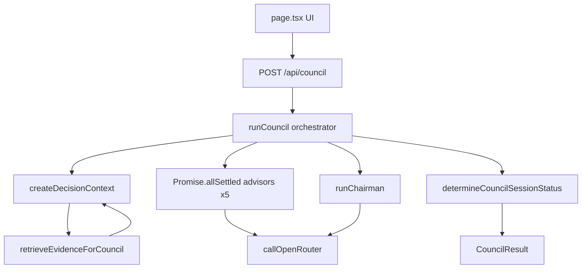

# WP-01 Stage A — Baseline Audit (Evidence Collection)

**IMP:** IMP-0001 — Decision Council Production Readiness (PEOS; published in `hercules-knowledge`)  
**Repository assessed:** `C:\Projects\Hercules\prodignus-council`  
**Assessment date:** 2026-07-27  
**Mode:** Forensic evidence collection only — **no redesign, no gap prioritization, no implementation**  
**Code changes:** None  

This document records the **current state** of the Decision Council implementation. Observations are traceable to source files. Speculative remediation is deferred to **WP-01 Stage B — Gap Analysis**.

---

# A. Executive Summary

The Decision Council is a **Next.js App Router** application (`prodignus-council`) that runs a single deliberation pipeline:

`UI → POST /api/council → runCouncil → PKOS retrieve → parallel advisors → Chairman → CouncilResult`

The implementation is a **live five-advisor council** with a live Chairman synthesizer, filesystem-based PKOS Context Retrieval Engine, and OpenRouter as the sole LLM provider. Advisor failures are isolated; sessions terminate with `complete` | `partial` | `failed`. OpenRouter includes **timeouts and bounded retries** (`MAX_RETRIES = 2`), despite README text claiming no retries.

There is **no separate deterministic Consensus Engine module**. “Consensus” is primarily **LLM-authored Chairman output** plus **session-status heuristics**. PKOS retrieval soft-fails when unavailable. Observability is **console logging + `executionId`**, with no metrics backend. Test coverage of council/PKOS/OpenRouter paths is **substantial** for a prototype, with notable gaps (API route HTTP tests; `pkos-smoke` not wired into `npm test`; no live provider CI).

**Maturity (Stage A conclusion):** **Partially Mature** — beyond experimental prototype for core orchestration, but not production-ready under IMP-0001 expectations for standardized observability, deterministic consensus, and operational evidence. Dimension-level ratings and the rationale for this overall score are recorded in **§G Maturity Assessment Matrix**.

---

# B. Architecture Assessment

## Current Implementation

| Layer | Reality |
|-------|---------|
| Stack | Next.js 16 / React 19 / TypeScript; dependencies limited to Next/React (no ORM, OTel, queue) |
| Entry | `src/app/page.tsx` → client fetch → `src/app/api/council/route.ts` → `runCouncil` |
| Core | `src/lib/council/*` orchestration, advisors, chairman, status, prompts |
| Provider | `src/lib/openrouter/*` |
| Knowledge | `src/lib/pkos/*` local filesystem CRE against `PKOS_REPOSITORY_PATH` |
| Config | `src/config/council.ts` + env vars (`.env.example`) |
| Version drift | `package.json` `0.1.0` vs `councilConfig.version` `0.3.5` |

### Current architecture (as implemented)

## Strengths

- Clear server-side pipeline; thin UI.
- Separation of orchestrator, advisor runner, chairman runner, PKOS engine, OpenRouter client.
- Shared immutable `DecisionContext` with integrity digest.
- Parallel advisors via `Promise.allSettled` with unexpected-rejection containment.

## Weaknesses

- No dedicated consensus aggregation service (LLM + heuristics only).
- Prototype/config flags present but unused by orchestrator.
- Empty `collectiveIntelligence` stub in Chairman context.
- README / code drift on retries.

## Risks

- Operators may trust docs over code (retry behavior misunderstood).
- Soft PKOS failure allows deliberation without canonical evidence without strong operational alerting.
- Session “consensus” non-determinism tied to LLM temperature 0.3.

## Supporting Evidence

- `src/lib/council/orchestrator.ts` — `runCouncil`
- `src/app/api/council/route.ts` — sole API route
- `src/config/council.ts` — version `0.3.5`, flags
- `package.json` — scripts and dependency set

---

# C. Component Assessments

---

## 1. Overall Architecture

### Current Implementation

Single-process Next.js app. One deliberation API. Five live advisors (ADV-001…005). Chairman enabled by config. PKOS evidence attached before advisors. Result includes advisors, optional chairman, PKOS package, integrity, durations, session status.

### Strengths

Modular library boundaries; provider isolation under `lib/openrouter/`; PKOS under `lib/pkos/`.

### Weaknesses

No persistence, auth, streaming, or peer-review (documented). Collective intelligence / analysis layer not materialized beyond empty object.

### Risks

Scaling and multi-tenant institutional use unsupported by current architecture surface.

### Supporting Evidence

- `src/lib/council/orchestrator.ts:59-110`
- `src/config/council.ts`
- `docs/` Sprint governance chain (ARR/IMP/AIR/ICR)

---

## 2. Chairman

### Current Implementation

`runChairman` (`chairman-runner.ts`):

1. Resolve `OPENROUTER_MODEL_CHAIRMAN` (config failure → failed result, no throw).
2. Build `ChairmanContext` via `DefaultChairmanContextBuilder` → prompts.
3. Gate: `< 3` successful advisors → failed with `insufficientCouncil: true`.
4. Call OpenRouter; parse structured JSON (`chairman-response-parser.ts`).
5. Exactly 3 successful advisors → `reducedConfidenceSynthesis: true`.
6. Provider/parse/context failures → `createFailedChairmanResult` with safe message.

Policy constants: min synthesis **3**, complete threshold **4** (`chairman-policy.ts`). Session status requires successful Chairman (`council-status.ts`).

### Strengths

- Failures return structured failed results rather than crashing the API.
- Explicit insufficient-participation path.
- Schema-oriented parsing with dedicated error types.
- Context builder with `schemaVersion: "1.0"`.

### Weaknesses

- Synthesis quality fully dependent on LLM + advisor inputs.
- `collectiveIntelligence: {}` always empty — no pre-Chairman deterministic analysis feed.
- Temperature hardcoded `0.3` in runner path (no config surface observed for Chairman temperature).

### Risks

- Empty/invalid Chairman outputs possible when provider returns malformed content (mitigated by parse failures → failed result).
- Reduced-confidence path may be under-communicated operationally.

### Supporting Evidence

- `src/lib/council/chairman-runner.ts`
- `src/lib/council/chairman-context-builder.ts` (empty `collectiveIntelligence`)
- `src/lib/council/chairman-policy.ts`
- `src/lib/council/chairman-prompt.ts`, `chairman-response-parser.ts`
- `src/lib/council/council-status.ts`

---

## 3. Advisor Orchestration

### Current Implementation

- All five advisors launched in parallel (`Promise.allSettled`).
- Per-advisor `runAdvisor` with persona routing (`advisor-response-router.ts`).
- ADV-002…005 have dedicated prompt/parser modules; ADV-001 uses generic Contrarian path.
- Missing model env → failed advisor + configuration error logging.
- Provider/parse errors swallowed into `status: "failed"` advisor results.
- Unexpected promise rejection mapped to safe failed result in orchestrator.

### Strengths

- True parallelism; isolation of advisor failures.
- Dedicated per-advisor modules for four personas improve maintainability of schemas.
- Shared decision context across advisors.

### Weaknesses

- **No advisor-level retry loop** (retries only inside OpenRouter client).
- **No per-advisor timeout** distinct from OpenRouter request timeout (default 90s shared).
- No sequencing/barrier beyond “all settled then Chairman”.

### Risks

- One slow advisor holds the stage up to the provider timeout.
- Five concurrent OpenRouter calls amplify rate-limit / cost exposure.

### Supporting Evidence

- `src/lib/council/orchestrator.ts:72-86`
- `src/lib/council/advisor-runner.ts`
- `src/lib/council/advisor-execution-config.ts`
- `src/lib/council/advisor-response-router.ts`

---

## 4. Consensus Engine

### Current Implementation

**No standalone consensus engine module exists.**

Consensus-related behavior today:

| Mechanism | Location | Nature |
|-----------|----------|--------|
| LLM `consensus` / `disagreements` / `minorityView` fields | Chairman prompt + parser | Non-deterministic text/structure from model |
| Session status heuristics | `council-status.ts` + policy thresholds | Deterministic given statuses |
| Empty CI stub | `collectiveIntelligence: {}` | Unused |

PKOS “insufficient evidence” is a **retrieval status**, not a consensus aggregation outcome.

### Strengths

- Chairman prompt instructs material consensus (not vote counting) — design intent visible in prompts/tests.
- Session status rules are explicit and tested.

### Weaknesses

- No reproducible aggregation of advisor opinions independent of the Chairman LLM.
- Conflict / minority handling is prompt-driven, not algorithmic.
- Typed `consensus?: unknown` on CI context unused.

### Risks

- Same inputs can yield different “consensus” narratives across runs.
- IMP-0001 / ENG-0003 consensus expectations cannot be validated against a dedicated engine today.

### Supporting Evidence

- `src/lib/council/chairman-prompt.ts` — consensus instructions
- `src/lib/council/chairman-response-parser.ts` — `consensus` array parse
- `src/lib/council/chairman-context-builder.ts:120` — empty CI
- Absence of `src/lib/council/*consensus*` module

---

## 5. PKOS Integration

### Current Implementation

Filesystem CRE (`retrieveEvidenceForCouncil`):

discover → parse metadata → governance eligibility → rank → resolve → evidence package.

Attached to decision context before advisors. Evidence formatted into prompts (`evidence-prompt.ts`). Soft-fail paths:

- Missing/invalid `PKOS_REPOSITORY_PATH` → failed package + warning; council continues.
- No matches → `insufficient`.
- Drafts/conflicts → `partial`.

Ranking/resolution use deterministic scoring (`ranking.ts`, `resolver.ts`); `MINIMUM_RELEVANCE_SCORE = 50`.

### Strengths

- Aligns with ADR-0007 direction (retrieval before deliberation; no direct repo browse by LLM).
- Graceful degradation when PKOS unavailable.
- Dedicated tests (`pkos-context-retrieval.test.mjs`).

### Weaknesses

- Local FS only (no remote PKOS HTTP API).
- Soft-fail allows sessions without canonical evidence.
- `createInsufficientEvidencePackage` helper defined but unused (dead helper).
- `pkos-smoke.test.mjs` exists but not listed in `npm test` script (observed).

### Risks

- Staging/production misconfiguration yields silent evidence-less councils.
- Path coupling to developer machines via env.

### Supporting Evidence

- `src/lib/pkos/context-retrieval-engine.ts`
- `src/lib/pkos/config.ts`, `resolver.ts`, `evidence-package-builder.ts`
- `src/lib/council/evidence-prompt.ts`
- `src/lib/council/orchestrator.ts:62-66`

---

## 6. OpenRouter Integration

### Current Implementation

`callOpenRouter` in `client.ts`:

- URL `https://openrouter.ai/api/v1/chat/completions`
- Bearer API key from `OPENROUTER_API_KEY`
- Timeout via `AbortController` (default **90_000** ms; env `OPENROUTER_REQUEST_TIMEOUT_MS`)
- **`MAX_RETRIES = 2`** for retryable errors (5xx/429/408, network, invalid provider payload)
- `response_format: json_object`
- Diagnostics / lifecycle logging for invalid responses and Chairman retries
- Models selected per role via env (`OPENROUTER_MODEL_*`)

### Strengths

- Provider isolated from domain types.
- Retry + timeout implemented in code.
- Diagnostics attempt to avoid secret leakage (tested).
- Sanitized provider error messages (slice to 500 chars).

### Weaknesses

- Retry policy not exposed as shared configurable “retry module” for orchestrator-level policy.
- No alternate-provider fallback after exhaustion.
- README still claims no retries (documentation drift).

### Risks

- Cost amplification under partial outages (5 advisors × retries).
- Operators may disable/mis-set timeout without centralized policy docs.

### Supporting Evidence

- `src/lib/openrouter/client.ts` — `DEFAULT_TIMEOUT_MS`, `MAX_RETRIES`, retry loop ~L372+
- `src/lib/openrouter/types.ts`, `provider-response-diagnostics.ts`, `execution-context.ts`
- `.env.example`

---

## 7. Prompt Management

### Current Implementation

Prompts are **TypeScript string builders** imported as modules:

- Generic / Contrarian: `advisor-prompt.ts`
- Per-advisor: `advisors/*-prompt.ts`
- Chairman: `chairman-prompt.ts`
- Shared evidence: `evidence-prompt.ts`
- Calibration / limits: `advisor-calibration.ts`, `advisor-response-limits.ts`

No external prompt store. Versioning via `ChairmanContext.schemaVersion` and `pipelineVersion: councilConfig.version`. Unused ThinkingLens branches remain in `advisor-prompt.ts`.

### Strengths

- Co-located with parsers; unit-tested prompt content (e.g. chairman TC-011…019).
- Shared evidence block reduces duplication across advisors/chairman.

### Weaknesses

- No checksum/version file for prompt text independent of app version.
- Dead lens branches increase cognitive load.
- Prompt changes require code deploy (expected for this design, but no prompt registry).

### Risks

- Silent prompt drift between advisors if shared discipline rules diverge.

### Supporting Evidence

- `src/lib/council/advisor-prompt.ts`, `chairman-prompt.ts`, `evidence-prompt.ts`
- `src/lib/council/advisors/*`

---

## 8. Configuration

### Current Implementation

**Env (required for live):** `OPENROUTER_API_KEY`, five advisor model envs, chairman model env.  
**Env (optional):** timeout, HTTP referer, `PKOS_REPOSITORY_PATH`, PKOS max sources/excerpt chars.  
**Hardcoded config object:** `councilConfig` with `chairmanEnabled`, `minimumSuccessfulAdvisors: 3`, version, disclaimer.  
**Unread / unused flags:** `prototypeMode`, `prototypeAdvisorIds`, `prototypeChairman`, `executionMode` (orchestrator does not branch on them).  
Secrets via env; `.env.local` gitignored per project docs.

### Strengths

- Model IDs externalized per role.
- PKOS path optional with soft fail.

### Weaknesses

- Temperature largely hardcoded (0.3).
- Retry count hardcoded (`MAX_RETRIES = 2`).
- Version mismatch package vs config.
- Feature flags present but inert.

### Risks

- False sense that prototype flags control runtime behavior.
- Config knobs incomplete vs IMP-0001 NFR-CFG expectations.

### Supporting Evidence

- `src/config/council.ts`
- `.env.example`
- `advisor-execution-config.ts`, `chairman-execution-config.ts`

---

## 9. Error Handling

### Current Implementation

| Layer | Behavior |
|-------|----------|
| API | 400 `INVALID_REQUEST` / 500 `INTERNAL_ERROR`; successful deliberation returns `ok: true` even with partial participant failures |
| Advisors/Chairman | Catch → failed participant objects; safe user messages via `toAdvisorSafeMessage` |
| OpenRouter | Typed `OpenRouterClientError` with `retryable` |
| PKOS | Soft-fail evidence package |
| UI | Alert + optional retry of deliberation |

Taxonomy in `src/lib/council/errors.ts` (`CouncilConfigurationError`, `AdvisorExecutionError`, `ProviderTimeoutError`, `InvalidModelOutputError`, …).

### Strengths

- Prefer structured degradation over hard 500 for participant failures.
- Safe message discipline for user-facing strings.

### Weaknesses

- Error model not uniformly surfaced as a single domain error code catalog in API responses for partial sessions.
- HTTP 200 with partial/failed council may mask operational severity without metrics.

### Risks

- Monitoring based only on HTTP status will miss failed councils.

### Supporting Evidence

- `src/app/api/council/route.ts`
- `src/lib/council/errors.ts`
- `src/lib/council/advisor-runner.ts`, `chairman-runner.ts`
- `src/app/page.tsx` (client retry UX)

---

## 10. Logging & Observability

### Current Implementation

Console-prefixed logs:

- `[Council Integrity]`, `[Council Advisor]`, `[Council Chairman]`, `[OpenRouter]`, `[OpenRouter Diagnostic]`, `[PKOS Retrieval]`, `[Council]`

Correlation: **`executionId`** (`crypto.randomUUID()` on decision context) threaded through prompts, results, and logs. **No** separate `correlationId`, OpenTelemetry, Sentry, or metrics exporter.

UI shows aggregated durations/tokens/cost (`council-metrics.tsx`, `aggregateCouncilMetrics`).

### Strengths

- `executionId` consistently present for a single run.
- Stage-oriented log prefixes aid manual debugging.
- Diagnostics module for invalid provider payloads.

### Weaknesses

- No structured log schema/backend.
- No exported retry/error rate metrics.
- No distributed tracing.

### Risks

- Production ops cannot alert on failure rates without scraping logs.
- IMP-0001 NFR-OBS-01 (stage events) only partially met via ad-hoc console logs.

### Supporting Evidence

- `src/lib/council/decision-context.ts` — `executionId`
- `src/lib/pkos/logging.ts`
- `src/lib/openrouter/provider-response-diagnostics.ts`
- Absence of OTel/metrics packages in `package.json`

---

## 11. Testing

### Current Implementation

Node.js native test runner via `npm test` with an explicit file list. Broad coverage of:

- Chairman (builder, prompt, parser, runner, behavior, card)
- Advisors (per-persona prompt/parser/advisor + reliability/calibration)
- Orchestrator integration
- OpenRouter diagnostics / retries
- Decision context integrity
- PKOS context retrieval
- Council status / display / client / form validation

### Strengths

- High density of unit/integration tests for core paths.
- Resilience-oriented tests for Contrarian/Delivery and OpenRouter invalid payloads.

### Weaknesses / Gaps

| Gap | Evidence |
|-----|----------|
| `pkos-smoke.test.mjs` not in `npm test` list | file exists under `tests/`; absent from package.json script |
| No dedicated HTTP tests for `route.ts` | no `api`/`route` test file found |
| No live OpenRouter CI smoke | mocked `fetch` patterns |
| No consensus-engine tests | no module |

### Risks

- Smoke scenarios may rot unused.
- API contract regressions undetected.

### Supporting Evidence

- `package.json` `"test"` script
- `tests/*.test.mjs` inventory
- `tests/orchestrator.integration.test.mjs`, `tests/pkos-context-retrieval.test.mjs`

---

## 12. Technical Debt

### Current Implementation (inventory)

| Item | Evidence |
|------|----------|
| Empty `collectiveIntelligence: {}` | `chairman-context-builder.ts` |
| Unused prototype flags | `councilConfig.prototypeMode` etc. |
| `AdvisorSource: "mock"` type without runtime mock path | `types/council.ts` |
| Unused `createInsufficientEvidencePackage` | `evidence-package-builder.ts` |
| Unused ThinkingLens branches | `advisor-prompt.ts` |
| Version mismatch | `package.json` 0.1.0 vs config 0.3.5 |
| README “no retries” vs code retries | README Limitations vs `MAX_RETRIES` |
| Historical assessment drift | `docs/assessments/decision-council-architecture-assessment.md` describes older hybrid state |
| Docs index incomplete for IMP-0003 | `docs/README.md` vs existing IMP-0003 file |

### Strengths

Debt is largely **visible** (stubs/flags) rather than hidden spaghetti.

### Weaknesses

Documentation and config flags lag the live-all-advisors reality.

### Risks

- Engineers may implement against stale assessments.
- Dead code paths confuse production-readiness judgment.

### Supporting Evidence

As listed above; also `docs/assessments/`, `docs/README.md`.

---

# D. Technical Debt Assessment (Summary)

Technical debt concentrates in four clusters:

1. **Unfinished analysis layer** — empty collective intelligence / no deterministic consensus module.
2. **Inert configuration surface** — prototype flags and incomplete runtime knobs (retry/temperature).
3. **Observability gap** — console-only; no metrics/tracing backend.
4. **Documentation drift** — README retries claim; historical assessments; version numbers; smoke test not wired.

None of these prevent local deliberation today; all reduce production confidence and maintainability.

---

# E. Engineering Risk Register

| ID | Description | Impact | Likelihood | Severity |
|----|-------------|--------|------------|----------|
| BR-01 | Chairman / consensus narratives vary run-to-run (LLM non-determinism) | Unpredictable advisory quality; hard to regression-test meaning | High | High |
| BR-02 | No algorithmic consensus engine | Cannot meet ENG-0003-style reproducible aggregation without LLM | Certain (current design) | High |
| BR-03 | PKOS soft-fail continues without evidence | Decisions without canonical knowledge; silent quality drop | Medium | High |
| BR-04 | Five parallel LLM calls × retries under outage | Cost spikes; rate limits; long sessions | Medium | High |
| BR-05 | Console-only observability | Failed councils invisible to HTTP monitors | High | High |
| BR-06 | README/code retry drift | Wrong operational assumptions | Medium | Medium |
| BR-07 | Unused prototype flags | False control plane confidence | Medium | Medium |
| BR-08 | `pkos-smoke` not in CI test script | Regression in smoke scenarios undetected | Medium | Medium |
| BR-09 | No API route automated tests | Contract breakage risk | Medium | Medium |
| BR-10 | Version identity split (0.1.0 vs 0.3.5) | Release/evidence ambiguity | High | Low |
| BR-11 | Empty CI stub may be mistaken for implemented analysis layer | Architecture false confidence | Medium | Medium |
| BR-12 | Shared 90s timeout as only advisor deadline | Stage latency dominated by slowest advisor | Medium | Medium |

---

# F. Executive Conclusion

### Maturity rating: **Partially Mature**

See **§G** for the dimension-level Maturity Assessment Matrix, the consolidated summary table, and the executive explanation of this overall rating.

The codebase is a **credible working council** suitable as an engineering baseline for IMP-0001 hardening. It is **not** yet a production-ready institutional system under IMP-0001 / ENG-0003 operational expectations.

---

# G. Maturity Assessment Matrix

**Purpose:** Make the overall **Partially Mature** rating transparent and repeatable.  
**Scale (applied consistently):** Mature | Mostly Mature | Partially Mature | Immature  
**Method:** Each dimension is rated independently from Stage A evidence. Ratings are descriptive of the **current** implementation, not aspirational targets.  
**Addendum:** Introduced in document v1.1 (Stage A enhancement only; no Stage B gap prioritization).

## Rating scale definitions

| Rating | Meaning |
|--------|---------|
| **Mature** | Dimension meets production-oriented expectations for this system class; residual gaps are minor |
| **Mostly Mature** | Solid foundation with limited, well-understood gaps that do not block basic operation |
| **Partially Mature** | Meaningful capability exists, but material gaps prevent confident production use |
| **Immature** | Capability is missing, ad hoc, or too weak to support operational confidence |

---

## G.1 Architecture

| Field | Content |
|-------|---------|
| **Current Rating** | **Mostly Mature** |
| **Justification** | Module boundaries are clear: orchestrator, advisor runner, chairman runner, PKOS engine, and OpenRouter client are separated. The deliberation pipeline is readable and maintainable for a single-process Next.js app. Design quality is reduced by an unfinished analysis/collective-intelligence stub and inert prototype configuration that does not participate in runtime control. |
| **Supporting Evidence** | `src/lib/council/orchestrator.ts`; `src/lib/council/*`; `src/lib/pkos/*`; `src/lib/openrouter/*`; `chairman-context-builder.ts` (`collectiveIntelligence: {}`); `src/config/council.ts` unused prototype flags |
| **Primary Improvement Opportunity** | Materialize or remove the collective-intelligence stub so architecture matches implemented behavior; retire or wire inert flags |

---

## G.2 Functional Completeness

| Field | Content |
|-------|---------|
| **Current Rating** | **Mostly Mature** |
| **Justification** | The end-to-end Decision Council workflow is implemented: PKOS retrieve → five live advisors → Chairman → session status → UI. Production-facing capabilities called out in architecture history (auth, persistence, streaming, peer review) and a deterministic consensus module are absent. Within IMP-0001’s “harden existing capability” framing, the core workflow is present; institutional completeness is not. |
| **Supporting Evidence** | `runCouncil` in `orchestrator.ts`; five ADV-* personas; `runChairman`; `retrieveEvidenceForCouncil`; README documented limitations (no persistence/auth/streaming); no `*consensus*` engine module |
| **Primary Improvement Opportunity** | Add reproducible consensus / analysis behavior before Chairman synthesis (without expanding into new product features) |

---

## G.3 Reliability

| Field | Content |
|-------|---------|
| **Current Rating** | **Partially Mature** |
| **Justification** | Participant failures are isolated and sessions still terminate with explicit status. OpenRouter applies a bounded retry loop and request timeout. Reliability is incomplete: there is no advisor-level retry policy, no per-advisor timeout distinct from the shared provider timeout, and PKOS soft-fail allows deliberation to continue without canonical evidence. Concurrent five-advisor fan-out amplifies outage/cost risk. |
| **Supporting Evidence** | `Promise.allSettled` in `orchestrator.ts`; `MAX_RETRIES = 2`, `DEFAULT_TIMEOUT_MS = 90_000` in `openrouter/client.ts`; PKOS soft-fail in `context-retrieval-engine.ts` / evidence package builders; advisor failures → `status: "failed"` in `advisor-runner.ts` |
| **Primary Improvement Opportunity** | Standardize retry/timeout policy across orchestration layers and harden PKOS-unavailable behavior for operational clarity |

---

## G.4 Determinism

| Field | Content |
|-------|---------|
| **Current Rating** | **Partially Mature** |
| **Justification** | Some pipeline elements are deterministic given fixed inputs: PKOS ranking/resolution scoring, context integrity digest, and session-status heuristics (min successful advisors / complete threshold). Core advisory meaning—Chairman consensus text, disagreements, and recommendation content—is LLM-generated at temperature 0.3 without a seed or algorithmic consensus engine, so outcomes are not reliably reproducible. |
| **Supporting Evidence** | `pkos/ranking.ts`, `pkos/resolver.ts`; `decision-context.ts` digest; `council-status.ts` / `chairman-policy.ts`; Chairman temperature and synthesis in `chairman-runner.ts`; consensus fields parsed in `chairman-response-parser.ts`; empty CI stub |
| **Primary Improvement Opportunity** | Introduce deterministic consensus aggregation (and/or stronger structured constraints) so “consensus” is not solely an LLM narrative |

---

## G.5 Error Handling

| Field | Content |
|-------|---------|
| **Current Rating** | **Mostly Mature** |
| **Justification** | Exception handling favors structured degradation: advisors and Chairman return failed participant objects with sanitized messages rather than crashing the request. OpenRouter errors are typed with retryability. Remaining weakness is API/HTTP semantics—successful HTTP responses can carry failed or partial councils—so operators cannot rely on status codes alone. |
| **Supporting Evidence** | `src/lib/council/errors.ts`; `advisor-runner.ts` / `chairman-runner.ts` catch → failed results; `OpenRouterClientError` in `openrouter/types.ts`; `src/app/api/council/route.ts` 200 + `ok: true` on partial outcomes; UI alert/retry in `page.tsx` |
| **Primary Improvement Opportunity** | Clarify failure semantics for clients and operators (session severity signals beyond HTTP 200) |

---

## G.6 Observability

| Field | Content |
|-------|---------|
| **Current Rating** | **Immature** |
| **Justification** | Debugging support exists via console prefixes and a shared `executionId`, plus UI duration/token aggregates. There is no metrics exporter, no distributed tracing, no structured log pipeline, and no operational alerting surface. Under IMP-0001 NFR-OBS expectations, this is insufficient for production operations. |
| **Supporting Evidence** | Console log helpers across council/PKOS/OpenRouter; `executionId` in `decision-context.ts`; `council-metrics.tsx` / `aggregateCouncilMetrics`; no OpenTelemetry/Sentry/metrics packages in `package.json` |
| **Primary Improvement Opportunity** | Emit stage events and retry/error/LLM metrics keyed by `executionId`, with an exportable monitoring path |

---

## G.7 Configuration Management

| Field | Content |
|-------|---------|
| **Current Rating** | **Partially Mature** |
| **Justification** | Model IDs and API key are environment-driven; PKOS path and some limits are configurable. Runtime reliability knobs (retry count, temperature, per-advisor timeouts) are largely hardcoded. Feature/prototype flags exist in `councilConfig` but are not consulted by the orchestrator, creating a false control plane. Version identity is split (`package.json` 0.1.0 vs config 0.3.5). |
| **Supporting Evidence** | `.env.example`; `advisor-execution-config.ts`; `chairman-execution-config.ts`; `MAX_RETRIES` / default temperature in `openrouter/client.ts`; `src/config/council.ts` |
| **Primary Improvement Opportunity** | Externalize retry/timeout/temperature policy and either wire or remove inert feature flags |

---

## G.8 Testability

| Field | Content |
|-------|---------|
| **Current Rating** | **Partially Mature** |
| **Justification** | Automated coverage is comparatively strong for unit and integration paths (Chairman, advisors, orchestrator, PKOS retrieval, OpenRouter diagnostics). Production confidence is limited by missing API-route HTTP tests, an unwired `pkos-smoke` suite, and no live provider CI smoke. There is no consensus-engine test surface because no such module exists. |
| **Supporting Evidence** | Explicit `npm test` file list in `package.json`; `tests/orchestrator.integration.test.mjs`; `tests/pkos-context-retrieval.test.mjs`; `tests/openrouter-diagnostics.test.mjs`; `tests/pkos-smoke.test.mjs` present but not in script; absence of `route`/`api` tests |
| **Primary Improvement Opportunity** | Wire smoke tests into CI, add API contract tests, and add resilience fixtures aligned to IMP-0001 acceptance scenarios |

---

## G.9 Maintainability

| Field | Content |
|-------|---------|
| **Current Rating** | **Mostly Mature** |
| **Justification** | Code organization is readable and extensible (per-advisor modules, shared evidence prompt, typed results). Technical debt is mostly visible stubs rather than opaque coupling. Maintainability is reduced by documentation/config drift (README retries claim, historical assessment lag, version mismatch, incomplete docs index for IMP-0003). |
| **Supporting Evidence** | `src/lib/council/advisors/*`; Stage A §12 debt inventory; README Limitations vs `MAX_RETRIES`; `docs/assessments/` historical assessment; `docs/README.md` index gap |
| **Primary Improvement Opportunity** | Align docs/flags/versioning with the live-all-advisors reality; prune dead helpers and unused lens branches |

---

## G.10 Operational Readiness

| Field | Content |
|-------|---------|
| **Current Rating** | **Partially Mature** |
| **Justification** | The application can be run and exercised in a development/Staging-like setup with env configuration and UI-level metrics. Operational readiness for support is weak: no monitoring/alerting, limited operational procedures in-repo for incident response, and no demonstrated rollback/runbook automation tied to council releases. Supportability depends on manual log inspection by `executionId`. |
| **Supporting Evidence** | Next.js deployability via standard scripts; console-only ops visibility; absence of ops metrics/runbook automation in app tree; IMP-0001 rollback expectations not yet evidenced in implementation |
| **Primary Improvement Opportunity** | Establish monitoring-ready telemetry and documented Staging deploy/smoke/rollback evidence path |

---

## G.11 Production Readiness

| Field | Content |
|-------|---------|
| **Current Rating** | **Partially Mature** |
| **Justification** | Against IMP-0001 objectives (reliability, observability, determinism, validation, operational confidence), the system shows a working deliberation core with partial reliability and substantial tests, but fails several production-critical bars: observability is immature, consensus determinism is weak, configuration is incomplete, and operational/Staging evidence packs are not yet established. The system is closer to a harden-ready baseline than to a production-authorized capability. |
| **Supporting Evidence** | Synthesis of G.1–G.10; IMP-0001 NFR/AC expectations; Stage A Executive Summary and risk register (BR-01…BR-05 especially) |
| **Primary Improvement Opportunity** | Close the High-priority dimension gaps (observability, determinism/consensus, reliability standardization, test/ops evidence) under IMP-0001 work packages |

---

## Summary Matrix

| Dimension | Rating | Primary Gap | Priority |
|-----------|--------|-------------|----------|
| Architecture | Mostly Mature | Unfinished collective-intelligence / analysis stub; inert flags | Medium |
| Functional Completeness | Mostly Mature | No deterministic consensus module; no auth/persistence (documented) | High |
| Reliability | Partially Mature | Retry/timeout standardization; PKOS soft-fail operational clarity | High |
| Determinism | Partially Mature | Algorithmic / reproducible consensus before Chairman | High |
| Error Handling | Mostly Mature | Session failure semantics beyond HTTP 200 | Medium |
| Observability | Immature | Metrics, structured stage events, tracing/export | High |
| Configuration Management | Partially Mature | Hardcoded retry/temperature; inert feature flags; version drift | Medium |
| Testability | Partially Mature | API route tests; wire `pkos-smoke`; live/resilience CI confidence | High |
| Maintainability | Mostly Mature | Documentation/config/version drift; dead code paths | Medium |
| Operational Readiness | Partially Mature | Monitoring, support runbooks, Staging rollback evidence | High |
| Production Readiness | Partially Mature | Combined High-priority gaps across reliability, observability, determinism, validation | High |

### Rating distribution (baseline)

| Rating | Count | Dimensions |
|--------|------:|------------|
| Mature | 0 | — |
| Mostly Mature | 4 | Architecture; Functional Completeness; Error Handling; Maintainability |
| Partially Mature | 6 | Reliability; Determinism; Configuration; Testability; Operational Readiness; Production Readiness |
| Immature | 1 | Observability |

---

## Why the Overall Rating is "Partially Mature"

The overall rating is **Partially Mature** because the Decision Council already delivers a coherent live deliberation system—modular architecture, end-to-end workflow, structured participant failures, provider timeouts/retries, PKOS retrieve-before-deliberate, and a meaningful automated test base—yet **multiple High-priority dimensions remain below “Mostly Mature.”**

It is **not Mostly Mature** because observability is **Immature**, and reliability, determinism, configuration, testability, and operational readiness are only **Partially Mature**. Those gaps directly undermine IMP-0001 production objectives: operators cannot monitor session health, consensus meaning is not reproducibly aggregated, and Staging/production confidence cannot yet be evidenced at institutional standard.

It is **not Immature / Experimental overall** because the core orchestration path is real and exercised (five live advisors + Chairman + PKOS + OpenRouter), not a mock-only prototype. The limiting factors are **production qualities** (visibility, reproducibility, operational controls), not absence of the product workflow itself.

**Primary limiting factors:** (1) no operational metrics/tracing, (2) no deterministic consensus engine, (3) incomplete reliability/config policy surface, (4) incomplete validation/ops evidence for Staging readiness.

---

## Post-Implementation Success Criteria

After IMP-0001 closes, this Maturity Assessment Matrix shall be **re-scored in place** (same dimensions, same four-level scale, same evidence discipline) as a before/after benchmark.

**Objective reuse:**

1. Re-evaluate each dimension with fresh file/test/ops evidence from WP-02…WP-08 delivery.
2. Require movement of **High-priority** dimensions (especially Observability, Determinism, Reliability, Testability, Operational Readiness, Production Readiness) upward by at least one rating band where IMP-0001 scope addressed that dimension—or document accepted residual risk if unchanged.
3. Treat overall **Production Readiness** as the roll-up: IMP-0001 success implies Production Readiness is no longer limited primarily by observability/determinism/reliability gaps identified here, even if absolute “Mature” is not claimed for every dimension.
4. Preserve this Stage A matrix as the immutable baseline snapshot (v1.1) and publish a post-IMP addendum or successor assessment rather than silently rewriting history.

This provides an objective demonstration of engineering progress independent of narrative claims.

---

## Baseline Snapshot (quick reference)

| Area | Present? | Notes |
|------|----------|-------|
| Parallel advisors | Yes | `Promise.allSettled` |
| Advisor-level retries | No | Provider-level only |
| OpenRouter retries | Yes | `MAX_RETRIES = 2` |
| OpenRouter timeout | Yes | Default 90s |
| Chairman fail → structured result | Yes | |
| Deterministic consensus module | No | LLM + status heuristics |
| PKOS retrieve-before-deliberate | Yes | Soft-fail if missing |
| Correlation / execution ID | Yes | `executionId` |
| Metrics backend | No | UI aggregates only |
| Hybrid/mock advisors at runtime | No | All live; mock type residual |
| Prototype flags effective | No | Present but unused |

---

## Code modifications during Stage A

**None** (including this v1.1 maturity-matrix addendum — documentation only).

---

## Next step (out of Stage A scope)

**WP-01 Stage B — Gap Analysis:** compare this baseline (including §G maturity ratings) to IMP-0001 requirements and map gaps to WP-02…WP-08.

**Status:** Complete — see [WP-01-STAGE-B-GAP-ANALYSIS.md](./WP-01-STAGE-B-GAP-ANALYSIS.md).

---

*WP-01 Stage A Evidence Collection — Prodignus Decision Council (`prodignus-council`) under IMP-0001 · Document v1.1*