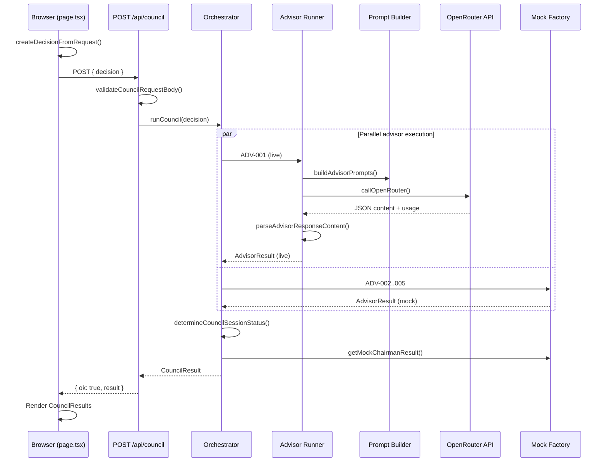

# Decision Council — Architecture Assessment

| Field | Value |
|-------|-------|
| **Document ID** | Architecture Assessment (baseline) |
| **Assessment date** | 2026-07-20 |
| **Baseline commit** | `cc90061` — *refactor: introduce server-side Council orchestrator* |
| **Assessor role** | Principal Software Architect |
| **Repository** | `prodignus-council` |
| **Status** | Historical |
| **Assessment type** | Read-only baseline (no code changes at time of assessment) |

> **Historical notice.** This assessment describes the Prodignus Decision Council as observed at commit `cc90061` on 2026-07-20. It is **supporting analysis**, not normative architecture. For current canonical architecture, see **ENG-0003**, **ENG-0004**, **ADR-0007**, and **KA-0001** in the [`hercules-knowledge`](https://github.com/TulioT99/hercules-knowledge) repository.

> **Subsequent implementation (post-assessment).** The following major capabilities were implemented after this baseline and are **not reflected** in the body of this document unless noted:
>
> - All five Advisors execute live via OpenRouter with persona-specific prompt modules.
> - Live Chairman synthesis via `chairman-runner.ts`, `chairman-context-builder.ts`, and structured response parsing.
> - Collective Intelligence Layer (`ChairmanContextBuilder`) per ADR-0003 and ENG-0002.
> - Executive recommendation presentation layer (ADR-0008 in `hercules-knowledge`).
> - PKOS Context Retrieval Engine integrated at the Council orchestration boundary (Sprint 3; ENG-0004, ADR-0007).
> - Expanded automated test coverage (254+ tests at time of publication).
>
> Present-state implementation facts in the current `prodignus-council` repository supersede historical observations here. Architectural observations in this assessment may remain relevant where not contradicted by current evidence.

---

## 1. Executive Summary

The Prodignus Decision Council is a **young, intentionally scoped hybrid prototype** that has evolved through three sprints in approximately one day of development. It delivers a working end-to-end flow: a browser form submits a structured `Decision`, a server-side orchestrator runs five advisor personas (one live via OpenRouter, four static mocks), attaches a static Chairman result, and returns a typed `CouncilResult` for display.

**What works today:** The core domain model, UI shell, API boundary, generic advisor runner, OpenRouter integration for ADV-001 (The Contrarian), parallel advisor execution, structured JSON output parsing, partial-failure semantics, and production build pipeline.

**What is incomplete:** Live LLM coverage (4 of 5 advisors), live Chairman synthesis, streaming/progress, persistence/history, multimodal inputs (images, PDF, attachments), Portuguese localization, retries, cost estimation, and comprehensive testing.

**Architectural posture:** The Sprint 3 refactor introduced the right extension points (`orchestrator`, `advisor-runner`, `advisor-prompt`, `advisor-execution-config`) without over-engineering. The codebase is **well-positioned for incremental evolution** toward a full multi-LLM council rather than requiring a rewrite.

**Critical finding:** The **MVP Specification document referenced in the assessment brief was not found** in this repository (searched for `*MVP*`, `*spec*`, and related terms). Gap analysis in Section 13 therefore compares the implementation against (a) the capability checklist in the assessment brief, (b) the product vision stated in the brief (*multi-LLM decision engine with Advisors + Chairman*), and (c) README-documented limitations. **Assumption:** the intended MVP expects all five advisors and a live Chairman orchestrated via OpenRouter, with the capabilities listed in the assessment brief unless the external MVP spec states otherwise.

**Overall readiness:** Suitable as an **architecture baseline and integration proof-of-concept**, not yet as a production multi-LLM decision engine.

---

## 2. Repository Overview

### 2.1 Location and Git State

| Attribute | Value |
|-----------|-------|
| Repository | `prodignus-council` |
| Git repository | Yes |
| Current branch (at assessment) | `master` |
| Working tree (at assessment) | Clean (no uncommitted changes) |
| Remote tracking | Not verified in this assessment |

### 2.2 Commit History

| Commit | Date | Message |
|--------|------|---------|
| `eabccee` | 2026-07-19 12:31 | Initial commit from Create Next App |
| `ddc6f21` | 2026-07-19 12:56 | feat: build Prodignus Decision Council frontend prototype |
| `ca41b75` | 2026-07-19 13:40 | feat: integrate live Contrarian advisor with OpenRouter |
| `cc90061` | 2026-07-19 13:56 | refactor: introduce server-side Council orchestrator |

**Project age:** ~1 calendar day from initial scaffold to current baseline (2026-07-19).

### 2.3 Package Manager, Framework, Runtime

| Attribute | Value |
|-----------|-------|
| Package manager | npm (`package-lock.json` present) |
| Framework | Next.js 16.2.10 (App Router, Turbopack build) |
| UI library | React 19.2.4 |
| Language | TypeScript 5 (strict mode) |
| Styling | Tailwind CSS 4 |
| Runtime | Node.js (build and tests executed successfully) |
| Application version | `councilConfig.version` = **0.3.0**; `package.json` version = **0.1.0** (version mismatch — see Technical Debt) |

### 2.4 Build and Test Verification

| Check | Result |
|-------|--------|
| `npm run build` | ✓ Success (TypeScript + static generation) |
| `npm test` | ✓ 3/3 tests pass (`council-status.test.mjs`) |
| Routes | `/` (static), `/api/council` (dynamic POST) |

---

## 3. Architecture Overview

### 3.1 Complete Architecture Tree

```
prodignus-council/
├── public/                          # Static assets (Next.js default SVGs)
├── src/
│   ├── app/                         # Next.js App Router — UI shell + API
│   │   ├── api/council/route.ts     # Primary Council API endpoint
│   │   ├── globals.css              # Tailwind + theme tokens
│   │   ├── layout.tsx               # Root layout, fonts, metadata
│   │   └── page.tsx                 # Home — form, loading, results
│   ├── components/                  # React presentation layer
│   │   ├── advisor-card.tsx         # Single advisor result card
│   │   ├── chairman-card.tsx        # Chairman consolidated output
│   │   ├── council-form.tsx         # Decision input form
│   │   ├── council-results.tsx      # Session summary + result layout
│   │   └── loading-state.tsx        # Static in-flight UI
│   ├── config/
│   │   └── council.ts               # Non-secret Council configuration
│   ├── data/                        # Static data — personas, mocks, examples
│   │   ├── advisor-personas.ts      # Five advisor persona definitions
│   │   ├── example-decision.ts      # Pre-filled example for demo
│   │   └── mock-council-result.ts   # Static mock advisor + Chairman content
│   ├── lib/
│   │   ├── council/                 # Server-side Council domain logic
│   │   │   ├── advisor-execution-config.ts  # Live advisor → env var mapping
│   │   │   ├── advisor-prompt.ts            # Generic prompt builder (all lenses)
│   │   │   ├── advisor-runner.ts            # Live advisor execution pipeline
│   │   │   ├── council-status.ts            # Session status computation
│   │   │   ├── errors.ts                    # Council error taxonomy
│   │   │   ├── orchestrator.ts              # Council orchestration entry point
│   │   │   ├── response-parser.ts           # LLM JSON output validation
│   │   │   └── validation.ts                # Request/decision validation
│   │   └── openrouter/              # OpenRouter HTTP client
│   │       ├── client.ts            # fetch-based chat completions
│   │       └── types.ts             # Request/response/error types
│   └── types/
│       └── council.ts               # Shared domain type definitions
├── tests/
│   └── council-status.test.mjs      # Unit tests for session status logic
├── .env.example                     # OpenRouter env var template
├── AGENTS.md / CLAUDE.md            # Next.js agent rules (minimal)
├── README.md                        # Sprint 3 architecture documentation
├── eslint.config.mjs
├── next.config.ts                   # Default (empty options)
├── package.json
├── postcss.config.mjs
└── tsconfig.json
```

**Not present (at baseline):** `uploads/`, prompt library folder, Chairman runner, persistence layer, auth, logging module, DI container, integration/e2e tests, MVP specification document.

### 3.2 Major Module Responsibilities

| Module | Responsibility |
|--------|----------------|
| **UI (`src/app`, `src/components`)** | Collect decision input, invoke API, render loading state and structured results. No business logic beyond client-side form validation and decision ID generation. |
| **API (`src/app/api/council`)** | HTTP boundary: JSON parse, validate `Decision`, invoke orchestrator, map errors to HTTP status codes. |
| **Council (`src/lib/council`)** | Core domain orchestration: parallel advisor resolution, status computation, error mapping, prompt construction, response parsing. |
| **Advisors (data + runner)** | Persona definitions in `advisor-personas.ts`; live execution via `advisor-runner.ts`; mocks in `mock-council-result.ts`. |
| **Chairman (mock only)** | Static template in `mock-council-result.ts`; rendered by `chairman-card.tsx`. No server-side synthesis logic. |
| **OpenRouter (`src/lib/openrouter`)** | Server-only HTTP client for chat completions; no SDK dependency. |
| **Configuration** | `council.ts` (behavior flags), `advisor-execution-config.ts` (live advisor env mapping), `.env.local` (secrets). |
| **Types (`src/types/council.ts`)** | Canonical domain contracts shared across client and server. |
| **Tests** | Minimal coverage of `determineCouncilSessionStatus` only. |

### 3.3 Execution Flow Diagram



### 3.4 Data Flow

1. **Input:** `CouncilRequest` (title, question, context, constraints) → client builds `Decision` (adds id, createdAt, status).
2. **Transport:** JSON POST `{ decision: Decision }` to `/api/council`.
3. **Processing:** Orchestrator produces `AdvisorResult[]` + optional `ChairmanResult`.
4. **Output:** `CouncilResult` with session status, per-advisor structured fields, aggregate duration.
5. **Display:** React components render cards; no secondary transformation layer.

---

## 4. Technology Stack

| Technology | Role | Evidence / Rationale |
|------------|------|----------------------|
| **Next.js 16 App Router** | Full-stack framework | Single repo for UI + API; `server-only` imports enforce server boundaries; README documents Sprint 3 server orchestration. |
| **React 19** | UI rendering | Client components for interactivity (`"use client"` on page and form). |
| **TypeScript (strict)** | Type safety | Shared `Decision`, `AdvisorResult`, `CouncilResult` contracts across layers. |
| **Tailwind CSS 4** | Styling | Utility-first; minimal custom CSS in `globals.css`. |
| **Native `fetch`** | OpenRouter HTTP | No OpenRouter SDK; lightweight, full control over timeout/abort. |
| **`server-only` package pattern** | Server boundary | All council/openrouter lib files import `"server-only"`. |
| **Hand-rolled validation** | Input + output validation | `validation.ts` and `response-parser.ts` — no Zod/Yup. Keeps dependencies minimal. |
| **Node built-in test runner** | Unit tests | `node --experimental-strip-types --test`; no Jest/Vitest. |
| **Geist fonts** | Typography | Loaded via `next/font/google` in layout. |
| **ESLint + eslint-config-next** | Linting | Standard Next.js lint setup. |

**Not present (and not required at current stage):** Redux/Zustand, React Query, Zod, Winston/Pino, DI (Inversify/tsyringe), PDF library, image processing, OpenRouter SDK, ORM/database, i18n framework.

---

## 5. Functional Assessment

Classification key: **Implemented** | **Partially Implemented** | **Prototype** | **Missing** | **Unknown**

| Capability | Status | Evidence |
|------------|--------|----------|
| Home screen | **Implemented** | `src/app/page.tsx` — header, form, results, footer |
| Question input | **Implemented** | `CouncilForm` with title, question, context, constraints |
| Prompt submission | **Implemented** | POST `/api/council` with structured `Decision` |
| OpenRouter integration | **Partially Implemented** | Live for ADV-001 only; `src/lib/openrouter/client.ts` |
| Multiple Advisors | **Partially Implemented** | 5 personas defined; 1 live, 4 static mocks |
| Chairman | **Prototype** | Static template; does not consume advisor outputs |
| Parallel execution | **Implemented** | `Promise.all` in `orchestrator.ts` |
| Streaming | **Missing** | `stream: false` in OpenRouter client |
| Execution progress | **Prototype** | `LoadingState` is static; no SSE/WebSocket/polling |
| Metrics | **Partially Implemented** | Per-advisor `durationMs`, `totalTokens`; session `totalDurationMs`; no cost $ |
| History | **Missing** | No persistence; results lost on refresh |
| Uploads | **Missing** | No upload UI, API, or storage |
| Images | **Missing** | No multimodal message content |
| PDF | **Missing** | No PDF parsing library or pipeline |
| Portuguese support | **Missing** | UI, prompts, and metadata in English (`lang="en"`) |
| Error handling | **Partially Implemented** | API 400/500; advisor failures degrade gracefully; no retry loop |
| Configuration | **Implemented** | `council.ts`, env vars, execution config |
| Testing | **Partially Implemented** | 3 unit tests; no integration/e2e tests |
| Environment variables | **Implemented** | `.env.example`: `OPENROUTER_API_KEY`, `OPENROUTER_MODEL_CONTRARIAN` |
| Example decision | **Implemented** | "Load Example" button → `example-decision.ts` |
| Session status (complete/partial/failed) | **Implemented** | `council-status.ts` + tests |
| Live vs mock labeling | **Implemented** | Badges in UI; `source: "live" \| "mock"` on results |
| Authentication | **Missing** | No auth middleware or user model |
| Peer review between advisors | **Missing** | Stated in README limitations |

---

## 6. Architecture Assessment

### 6.1 Layer Separation

| Layer | Location | Concerns |
|-------|----------|----------|
| Presentation | `src/app`, `src/components` | Rendering, local form state, fetch |
| API | `src/app/api/council/route.ts` | HTTP, status codes, request envelope |
| Application / Orchestration | `orchestrator.ts` | Workflow coordination |
| Domain services | `advisor-runner.ts`, `advisor-prompt.ts`, `response-parser.ts` | Advisor execution, prompts, parsing |
| Infrastructure | `openrouter/client.ts` | External LLM provider |
| Data / config | `src/data`, `src/config` | Static personas, mocks, flags |

**Observation:** Layers are logically separated within a monolithic Next.js app. No separate backend service.

### 6.2 Module Dependencies

```
page.tsx → components, config, types
api/council/route.ts → orchestrator, validation, types
orchestrator.ts → advisor-runner, advisor-execution-config, council-status, config, data, types
advisor-runner.ts → advisor-prompt, response-parser, openrouter/client, errors, types
advisor-prompt.ts → types, advisor-personas (via persona param)
openrouter/client.ts → types
components → types, config, data (loading-state only)
```

**Coupling notes:**
- UI depends on `councilConfig` for labels and live/mock distinction — acceptable.
- Mock data is tightly coupled to a **single example decision theme** (AI conversation vs guided journeys) — Chairman and ADV-002..005 mocks do not vary with user input.
- `advisor-personas.ts` is the single source of truth for persona metadata — good.

### 6.3 Extensibility

**Strengths:**
- Adding a live advisor = extend `LIVE_ADVISOR_EXECUTION` + env var + config `liveAdvisorIds`.
- `buildAdvisorPrompts()` is persona-generic with lens-specific instructions via `switch`.
- `AdvisorResult` schema is uniform across live and mock advisors.
- Orchestrator already parallelizes; adding advisors does not change the call pattern.

**Constraints:**
- Chairman has no runner interface or prompt module yet.
- No plugin/registry abstraction for advisors — configuration is a static record.
- No event bus or progress callback for streaming UI updates.

### 6.4 Strengths

1. **Clear domain model** — `Decision`, `AdvisorResult`, `ChairmanResult`, `CouncilResult` are well-defined and documented in types.
2. **Graceful degradation** — Live advisor failure returns HTTP 200 with partial result; session status reflects reality.
3. **Defense in depth on LLM output** — JSON fence stripping, schema validation, length limits in `response-parser.ts`.
4. **Server-side secret handling** — API key never exposed to client; `server-only` guards.
5. **Incremental sprint history** — Frontend → single live advisor → orchestrator refactor shows disciplined scope control.
6. **Production build passes** — TypeScript strict mode, no build errors.

### 6.5 Weaknesses

1. **Chairman disconnected from council outputs** — Undermines the product promise of consolidated decision-making.
2. **Mock advisors are decision-agnostic** — Same static text regardless of user question; misleading UX if labeled as "advisor perspectives."
3. **No real-time progress** — User waits for full `Promise.all` completion with static loading messages.
4. **Duplicated validation rules** — Form limits in `council-form.tsx` mirror but are not shared with `validation.ts`.
5. **Duplicated presentation constants** — `DECISION_LABELS`, `THINKING_LENS_LABELS` repeated across components and prompt module.
6. **Minimal observability** — No structured logging, tracing, or request correlation IDs.

### 6.6 Potential Risks

| Risk | Severity | Description |
|------|----------|-------------|
| Misleading mock outputs | High | Users may believe all five advisors analyzed their specific decision. |
| Chairman integrity | High | Static Chairman cannot reflect live Contrarian output or user question. |
| LLM JSON reliability | Medium | Parser handles fences; no repair/retry on malformed JSON. |
| Timeout at scale | Medium | 90s × parallel live advisors (future) may exceed serverless limits. |
| Cost visibility | Medium | Token counts captured; no pricing model or budget caps. |
| No rate limiting | Medium | Public API endpoint could be abused if deployed without auth. |
| Version drift | Low | `package.json` 0.1.0 vs `councilConfig` 0.3.0 |

---

## 7. Advisor Assessment

Five advisors are defined in `src/data/advisor-personas.ts`. Live execution uses `buildAdvisorPrompts()` in `src/lib/council/advisor-prompt.ts`.

### 7.1 ADV-001 — The Contrarian

| Attribute | Value |
|-----------|-------|
| **Purpose** | Construct the strongest grounded case against proceeding; identify hidden costs and failure modes. |
| **Thinking lens** | `contrarian` |
| **Model** | OpenRouter model from `OPENROUTER_MODEL_CONTRARIAN` env var |
| **Execution** | **Live** via `advisor-runner.ts` |
| **Responsibilities** | Independent assessment through contrarian lens; facts vs assumptions; risks; proceed/conditions recommendation. |
| **Output format** | JSON: `summary`, `analysis[]`, `assumptions[]`, `risks[]`, `recommendation`, `confidence` (0–100) |
| **Dependencies** | `advisor-prompt.ts`, `response-parser.ts`, `openrouter/client.ts` |
| **Limitations** | Single model; no retry; failure returns empty analysis with error message |

### 7.2 ADV-002 — The First Principles Thinker

| Attribute | Value |
|-----------|-------|
| **Purpose** | Rebuild solution from citizen need; challenge stated problem definition. |
| **Thinking lens** | `first-principles` |
| **Model** | "Prototype Mock Model" (static) |
| **Execution** | **Mock** — `MOCK_ADVISOR_TEMPLATES["ADV-002"]` |
| **Output format** | Same `AdvisorResult` shape (pre-filled) |
| **Dependencies** | `mock-council-result.ts`, persona metadata |
| **Limitations** | Content fixed to AI-vs-journeys scenario; not decision-specific |

### 7.3 ADV-003 — The Expansionist

| Attribute | Value |
|-----------|-------|
| **Purpose** | Identify strategic upside, reusable capabilities, ecosystem effects. |
| **Thinking lens** | `expansionist` |
| **Model** | Mock |
| **Execution** | Mock template ADV-003 |
| **Limitations** | Same static content issue |

### 7.4 ADV-004 — The Outsider

| Attribute | Value |
|-----------|-------|
| **Purpose** | Challenge GovTech conventions; cross-industry analogies; simplify for ordinary users. |
| **Thinking lens** | `outsider` |
| **Model** | Mock |
| **Execution** | Mock template ADV-004 |
| **Limitations** | Same static content issue |

### 7.5 ADV-005 — The Executor

| Attribute | Value |
|-----------|-------|
| **Purpose** | Smallest executable experiment; dependencies, owners, go/no-go criteria. |
| **Thinking lens** | `executor` |
| **Model** | Mock |
| **Execution** | Mock template ADV-005 |
| **Limitations** | Same static content issue |

### 7.6 Prompt Architecture (Advisor)

**Organization:** Single module `advisor-prompt.ts` with:
- Shared identity section from persona
- Shared advisor responsibility block
- Lens-specific instructions (`buildLensInstructions` switch)
- User prompt with decision fields + JSON schema

**Quality:** Prompts are structured, explicit about JSON-only output, forbid hallucinated facts, and define recommendation enum. Suitable for production iteration.

**Reuse:** One builder serves all lenses; adding ADV-002..005 live requires no new prompt module.

**Versioning:** None — prompts are inline strings.

**Duplication:** Lens labels duplicated in `advisor-card.tsx` and `advisor-prompt.ts`.

**Language:** English only.

### 7.7 Duplicated Responsibilities

| Overlap | Advisors involved | Notes |
|---------|-------------------|-------|
| Risk identification | All five | By design — each lens emphasizes different risk angles |
| Recommendation enum | All five | Shared schema — intentional |
| Assumption extraction | All five | Shared schema — intentional |
| Static mock thematic content | ADV-002..005 + Chairman | All mocks discuss the same Prodignus AI/journeys decision — **not** independent perspectives on arbitrary user input |

No improper duplication in live prompt logic; mock data reuse is the main concern.

---

## 8. Chairman Assessment

### 8.1 Current Implementation

| Attribute | Value |
|-----------|-------|
| **Location** | `src/data/mock-council-result.ts` → `MOCK_CHAIRMAN_TEMPLATE` |
| **Execution** | Static clone via `getMockChairmanResult()`; called unconditionally when `chairmanEnabled: true` |
| **Input** | **None** — does not receive `Decision` or `AdvisorResult[]` |
| **Output** | `ChairmanResult`: decision, executiveSummary, agreement/disagreement, assumptions, risks, upside, actions, finalRecommendation, confidence |
| **Prompt** | **None** — no LLM invocation |
| **Decision strategy** | Pre-written narrative favoring `test_first` for AI-in-journeys pilot |
| **Consensus mechanism** | **None** — static lists of agreement/disagreement |
| **UI labeling** | "Prototype Chairman (static mock, not live analysis)" — accurately disclosed |

### 8.2 Weaknesses

1. **No synthesis** — Cannot reconcile live Contrarian output with other advisors.
2. **Decision-blind** — Same Chairman text for any user question.
3. **False completeness** — UI presents Chairman as "Council Decision" alongside live advisor output, which may imply integrated deliberation.
4. **No Chairman runner** — No parallel module to `advisor-runner.ts` for Chairman LLM calls.
5. **No structured input assembly** — No logic to serialize advisor outputs for Chairman prompt context.

---

## 9. OpenRouter Assessment

### 9.1 Configuration

| Item | Implementation |
|------|----------------|
| API URL | `https://openrouter.ai/api/v1/chat/completions` (hardcoded) |
| Auth | `Authorization: Bearer ${OPENROUTER_API_KEY}` |
| Model selection | Per-advisor env var; only `OPENROUTER_MODEL_CONTRARIAN` mapped |
| Temperature | `0.3` (advisor-runner and client default) |
| Timeout | `90_000` ms via `AbortController` |
| Streaming | Explicitly disabled (`stream: false`) |

### 9.2 Authentication

- API key read from `process.env.OPENROUTER_API_KEY` at request time.
- Missing key → `CONFIGURATION_ERROR` → failed advisor result with safe message.
- `.env.example` documents required variables; `.env.local` git-ignored.

### 9.3 Error Handling

| Error type | Handling |
|------------|----------|
| Missing API key / model | `CouncilConfigurationError` → failed advisor |
| HTTP 4xx/5xx | `OpenRouterClientError`; 5xx and 429 marked retryable |
| Timeout | `PROVIDER_TIMEOUT` |
| Malformed JSON response | `INVALID_PROVIDER_RESPONSE` |
| Empty assistant content | `INVALID_PROVIDER_RESPONSE` |
| Network failure | Generic `PROVIDER_ERROR`, retryable |

**Gap:** `retryable: true` is set on several errors but **no retry logic exists** in client or runner.

### 9.4 Token Usage

- Extracts `prompt_tokens`, `completion_tokens`, `total_tokens` from response.
- Stored on `AdvisorResult.totalTokens`.
- Displayed in UI per advisor.
- **No cost estimation** — no model pricing lookup or dollar amounts.

### 9.5 Security

| Aspect | Status |
|--------|--------|
| API key in browser | Prevented (`server-only`) |
| Provider error message exposure | Sanitized/truncated to 500 chars |
| User-safe advisor errors | `toAdvisorSafeMessage()` |
| Rate limiting | Not implemented |
| Request logging | Not implemented (would risk logging prompts) |

### 9.6 SDK

No OpenRouter SDK — direct `fetch` with hand-typed request/response shapes in `types.ts`. Appropriate for current scope; may need SDK or wrapper as features grow (streaming, tool calls, multimodal).

---

## 10. Prompt Assessment

| Dimension | Assessment |
|-----------|------------|
| **Organization** | Centralized in `advisor-prompt.ts`; persona data in `advisor-personas.ts` |
| **Quality** | High for advisor role — clear identity, lens instructions, JSON schema, anti-hallucination rules |
| **Reuse** | Generic builder parameterized by `AdvisorPersona` |
| **Versioning** | None — no prompt IDs, hashes, or changelog |
| **Duplication** | Lens labels duplicated in UI; no duplicated advisor prompt text |
| **Chairman prompts** | Missing entirely |
| **Language** | English |
| **Maintainability** | Good for 5 lenses in one file; may need split if prompts grow or A/B testing is required |

---

## 11. Code Quality

Evidence-based assessment (not subjective scoring of style preferences).

### 11.1 Architecture Quality

- **Single Responsibility:** Orchestrator coordinates; runner executes; parser validates — observed separation holds.
- **Open/Closed:** New live advisors extend config without modifying runner internals — supported by current design.
- **Dependency direction:** UI → API → orchestrator → infrastructure; no reverse dependencies from lib to components.

### 11.2 Readability and Naming

- Consistent naming: `AdvisorResult`, `runCouncil`, `buildAdvisorPrompts`, `determineCouncilSessionStatus`.
- File names match responsibilities.
- Functions are reasonably sized; largest file is `mock-council-result.ts` (~250 lines of static content).

### 11.3 Consistency

- TypeScript strict mode throughout.
- `server-only` on all server lib modules.
- Minor inconsistency: client form validation duplicates server limits without shared constants module.

### 11.4 Folder Organization

- Conventional Next.js App Router layout.
- Council logic grouped under `src/lib/council/` — clear and scalable.

### 11.5 Testability

- Pure functions (`determineCouncilSessionStatus`, `parseAdvisorResponseContent`, `buildAdvisorPrompts`) are unit-testable.
- **Observed gap:** Only `council-status.ts` has tests; parser, validation, runner, and API untested.

### 11.6 Complexity

- Cyclomatic complexity is low across orchestrator and runner.
- No premature abstractions (no factory/registry/DI frameworks).

### 11.7 Maintainability

- **Good** for a 39-file codebase with clear README.
- **Risk** as mock content and live paths diverge without Chairman integration tests.

---

## 12. Technical Debt

### Critical

| ID | Problem | Impact | Recommendation |
|----|---------|--------|----------------|
| TD-C1 | Chairman presents council decision without analyzing inputs | Users may make decisions based on unrelated static text | Implement Chairman runner consuming `Decision` + `AdvisorResult[]`; until then, visually de-emphasize or hide Chairman in non-demo mode |
| TD-C2 | Mock advisors return fixed narrative unrelated to user decision | Misleading "five perspectives" UX | Wire ADV-002..005 to live runner OR clearly gate mocks behind demo mode |

### High

| ID | Problem | Impact | Recommendation |
|----|---------|--------|----------------|
| TD-H1 | No retry despite `retryable` flag | Transient provider failures become permanent advisor failures | Add bounded retry (e.g., 2 attempts) in `callOpenRouter` or runner |
| TD-H2 | No integration tests for API/OpenRouter path | Regressions in end-to-end flow undetected | Add mocked-fetch integration tests for `/api/council` |
| TD-H3 | No authentication on API | Abuse/cost exposure if deployed publicly | Add auth or API key before non-internal deployment |
| TD-H4 | MVP spec not in repository | Gap analysis and prioritization lack authoritative source | Add MVP spec to repo or link from README |

### Medium

| ID | Problem | Impact | Recommendation |
|----|---------|--------|----------------|
| TD-M1 | Duplicated validation constants (client vs server) | Client/server drift on field limits | Extract shared validation constants or schema |
| TD-M2 | Duplicated label maps across components | Maintenance overhead | Single `labels.ts` or derive from types |
| TD-M3 | Version mismatch (`package.json` 0.1.0 vs config 0.3.0) | Confusion in releases | Align versions |
| TD-M4 | No structured logging | Hard to debug production issues | Add server-side structured logs with correlation ID |
| TD-M5 | Static loading state vs actual progress | Poor UX for long OpenRouter calls | SSE or polling when streaming added |
| TD-M6 | `createPrototypeCouncilResult` exported but unused in main flow | Dead code path | Remove or document for tests/demo |

### Low

| ID | Problem | Impact | Recommendation |
|----|---------|--------|----------------|
| TD-L1 | Node test warning about module type | Noise in CI | Add `"type": "module"` to package.json or adjust test import |
| TD-L2 | Default Next.js SVG assets unused | Clutter | Remove when branding assets exist |
| TD-L3 | Empty `next.config.ts` | No custom headers/CORS | Configure when deployment target known |
| TD-L4 | `prototypeMode: false` in config while mocks active | Config semantics unclear | Rename or add explicit `hybridMode` documentation |

---

## 13. Gap Analysis

**Note:** The MVP Specification document was **not found** in the repository. "Expected" column reflects the assessment brief vision and standard expectations for a multi-LLM Decision Council MVP. **Validate against the external MVP spec when available.**

| Capability | Current | Expected (assumed MVP) | Gap | Priority |
|------------|---------|------------------------|-----|----------|
| Five live LLM advisors | 1 live, 4 static mocks | 5 live via OpenRouter | 4 advisors not connected | **P0** |
| Live Chairman synthesis | Static mock | LLM consolidates advisor outputs | No Chairman runner/prompt | **P0** |
| Decision-specific outputs | Live ADV-001 only | All outputs reflect user decision | Mocks ignore input | **P0** |
| OpenRouter integration | Single model/env | Per-advisor model config | 4 env mappings missing | **P1** |
| Streaming responses | None | Progressive advisor/chairman output | No SSE/stream parser | **P1** |
| Execution progress UI | Static loading | Real-time per-advisor status | No progress API | **P1** |
| Session history | None | Persist and recall past councils | No database/storage | **P2** |
| Metrics / cost | Tokens + duration | Cost estimation, session analytics | No pricing layer | **P2** |
| Multimodal (images) | None | Attach images to decisions | No upload/pipeline | **P2** |
| PDF support | None | Attach/parse PDF context | No PDF library | **P2** |
| Portuguese support | English only | PT-BR UI and prompts | No i18n | **P2** |
| Retries | Flag only | Automatic retry on transient errors | Not implemented | **P1** |
| Authentication | None | User/org scoping | Missing | **P2** |
| Testing | 3 unit tests | Integration + e2e coverage | Minimal | **P1** |
| Error handling | Partial degradation | Full observability + user guidance | No logging/alerting | **P2** |
| Peer review between advisors | None | Optional deliberation rounds | Not designed | **P3** |

---

## 14. Recommendations

### Keep

| Item | Rationale |
|------|-----------|
| Domain types (`src/types/council.ts`) | Mature contract; supports live and mock paths |
| Orchestrator pattern (`orchestrator.ts`) | Correct central coordination point |
| Generic advisor runner (`advisor-runner.ts`) | Already parameterized; proven with ADV-001 |
| Prompt builder with lens switch (`advisor-prompt.ts`) | Scales to all five advisors without duplication |
| OpenRouter fetch client | Simple, testable, no SDK lock-in at current scale |
| Response parser with schema validation | Essential guardrail for LLM outputs |
| Partial failure semantics + session status | Production-appropriate resilience |
| UI component structure | Clear form → loading → results flow |
| `server-only` boundaries | Security best practice |
| README architecture section | Accurate baseline documentation |

### Refactor

| Item | Rationale |
|------|-----------|
| Validation constants | Share between `council-form.tsx` and `validation.ts` |
| Label/constants maps | Consolidate `DECISION_LABELS`, lens labels |
| Mock data strategy | Separate "demo mode" from "hybrid production" paths explicitly in config |
| Version identifiers | Align `package.json` and `councilConfig.version` |
| Loading state | Drive from orchestrator events when progress API exists |

### Replace

| Item | Rationale |
|------|-----------|
| Static Chairman template | Replace with Chairman runner (do not incrementally patch mock) |
| Decision-agnostic mock advisor content | Replace with live calls or remove from non-demo flows |

### Remove

| Item | Rationale |
|------|-----------|
| Unused `createPrototypeCouncilResult` (if confirmed unused) | Reduce confusion |
| Default Next.js public SVGs | When custom branding added |

### Postpone

| Item | Rationale |
|------|-----------|
| Persistence / history | After live council path validated |
| Multimodal (PDF/images) | After text-only five-advisor + Chairman works |
| Portuguese i18n | After English MVP stable |
| Peer review rounds | Advanced feature; not blocking MVP |
| OpenRouter SDK migration | Current fetch client sufficient until streaming/tools needed |
| Separate microservice backend | Monolith appropriate for MVP scale |

---

## 15. Proposed Roadmap

Incremental evolution — **no full rewrite**.

### Phase 1 — Complete the text-only council (P0)

1. Add env vars and execution config for ADV-002..005 (`OPENROUTER_MODEL_*`).
2. Enable all five advisors in `liveAdvisorIds`; remove or gate static mocks behind `demoMode`.
3. Implement `chairman-runner.ts` + Chairman prompt assembling `Decision` + serialized advisor summaries.
4. Add integration tests with mocked OpenRouter responses.

### Phase 2 — Operational hardening (P1)

1. Bounded retries for retryable OpenRouter errors.
2. Structured logging with request/correlation ID.
3. Expand unit tests: parser, validation, advisor-runner error paths.
4. Optional: SSE endpoint for per-advisor completion events.

### Phase 3 — UX and observability (P1–P2)

1. Real execution progress in UI (polling or SSE).
2. Token + estimated cost display (OpenRouter pricing metadata or config table).
3. Auth/API key for deployment.

### Phase 4 — MVP extensions (P2)

1. Session persistence (SQLite/Postgres or external store).
2. History list and detail views.
3. Portuguese localization (prompts + UI).

### Phase 5 — Multimodal (P2+)

1. Attachment upload API and storage.
2. Image content in OpenRouter messages.
3. PDF text extraction pipeline.

---

## 16. Overall Architecture Score

Scores are 0–10 based on observed evidence against MVP readiness, not aesthetic preference.

| Dimension | Score | Explanation |
|-----------|-------|-------------|
| **Architecture** | **7 / 10** | Sound layering, orchestrator/runner separation, parallel execution, and extension points are in place. Deductions for missing Chairman pipeline, mock-heavy hybrid mode, and monolithic progress model. |
| **Maintainability** | **7 / 10** | Small codebase, strict TypeScript, clear folders, good README. Deductions for duplicated validation/labels, static mock bulk, and version mismatch. |
| **Extensibility** | **8 / 10** | Adding live advisors is configuration-driven; prompt builder is generic. Chairman and streaming need new modules but fit existing patterns. |
| **Code Quality** | **7 / 10** | Consistent patterns, appropriate error taxonomy, no over-engineering. Deductions for minimal tests and dead/unused export paths. |
| **Documentation** | **6 / 10** | README accurately describes Sprint 3 architecture and limitations. No MVP spec in repo, no API contract doc beyond types, no runbook. |
| **Readiness for MVP** | **4 / 10** | Proves OpenRouter integration and orchestration pattern, but 80% of council intelligence is static mock data and Chairman does not synthesize. Not MVP-complete for a multi-LLM decision engine. |

### Composite Assessment

**Weighted overall: ~6.2 / 10** as an engineering baseline; **~4 / 10** against assumed full MVP functionality.

The project is a **successful architectural foundation** after three focused sprints. The highest-value next step is activating the existing advisor runner for ADV-002..005 and introducing a Chairman runner — not restructuring the codebase.

---

## Appendix A — Environment Variables

| Variable | Required | Purpose |
|----------|----------|---------|
| `OPENROUTER_API_KEY` | Yes (live mode) | OpenRouter authentication |
| `OPENROUTER_MODEL_CONTRARIAN` | Yes (ADV-001) | Model ID for The Contrarian |

## Appendix B — API Contract Summary

**Endpoint:** `POST /api/council`

**Request:**
```json
{ "decision": { "id", "title", "question", "context", "constraints", "createdAt", "status", ... } }
```

**Success (200):** `{ "ok": true, "result": CouncilResult }`

**Validation failure (400):** `{ "ok": false, "error": { "code": "INVALID_REQUEST", ... } }`

**Orchestrator crash (500):** `{ "ok": false, "error": { "code": "INTERNAL_ERROR", ... } }`

**Partial advisor failure:** HTTP 200 with `ok: true`, failed advisor in `result.advisors`, `result.status` of `partial` or `failed`.

## Appendix C — Assumptions Log

| ID | Assumption |
|----|------------|
| A1 | MVP Specification document exists externally but is not committed to this repository |
| A2 | Expected MVP includes five live advisors and one live Chairman unless spec states otherwise |
| A3 | Deployment target not specified; serverless timeout limits not evaluated against hosting platform |
| A4 | `.env.local` exists locally (build referenced it) but contents were not inspected |

## Appendix D — Canonical Architecture References

| Document | Repository | Role |
|----------|------------|------|
| ENG-0003 | `hercules-knowledge` | Decision Council engineering specification |
| ENG-0004 | `hercules-knowledge` | PKOS Context Retrieval Engine |
| ADR-0007 | `hercules-knowledge` | Separation of executive reasoning and knowledge retrieval |
| KA-0001 | `hercules-knowledge` | PKOS architecture overview |

---

*End of assessment. This document reflects the codebase as observed at commit `cc90061` on 2026-07-20. Present-state implementation supersedes factual claims in this document where noted in the Historical notice above.*
