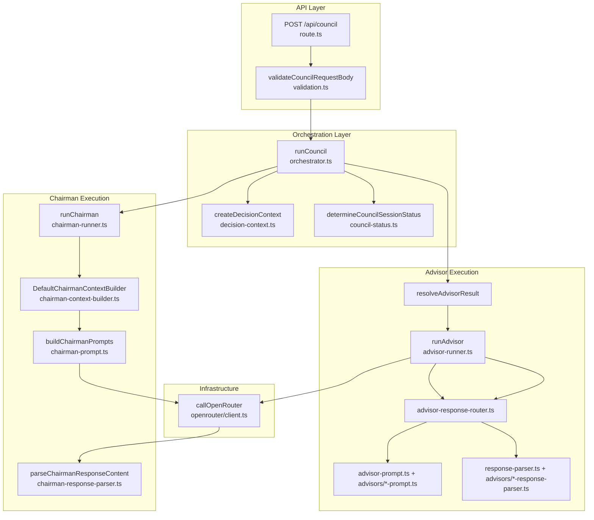
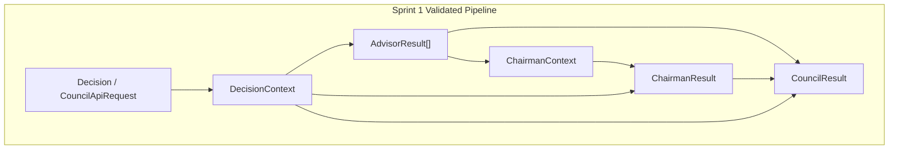
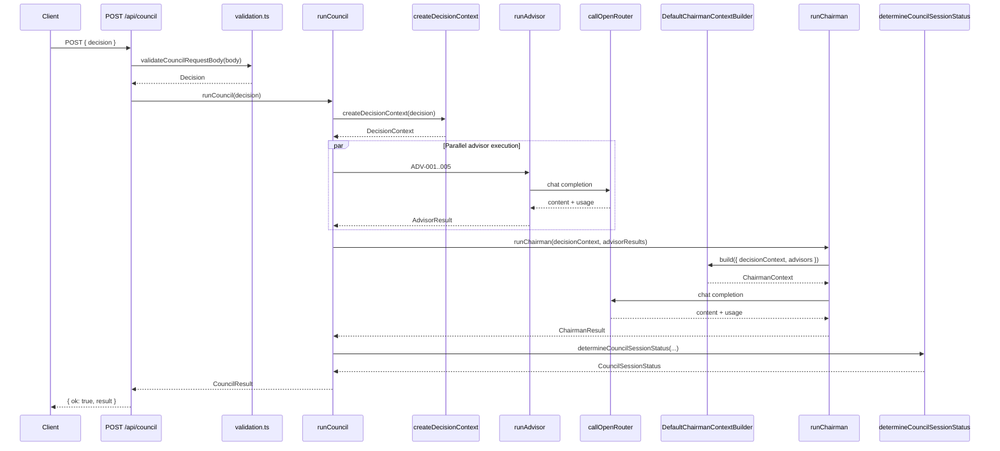
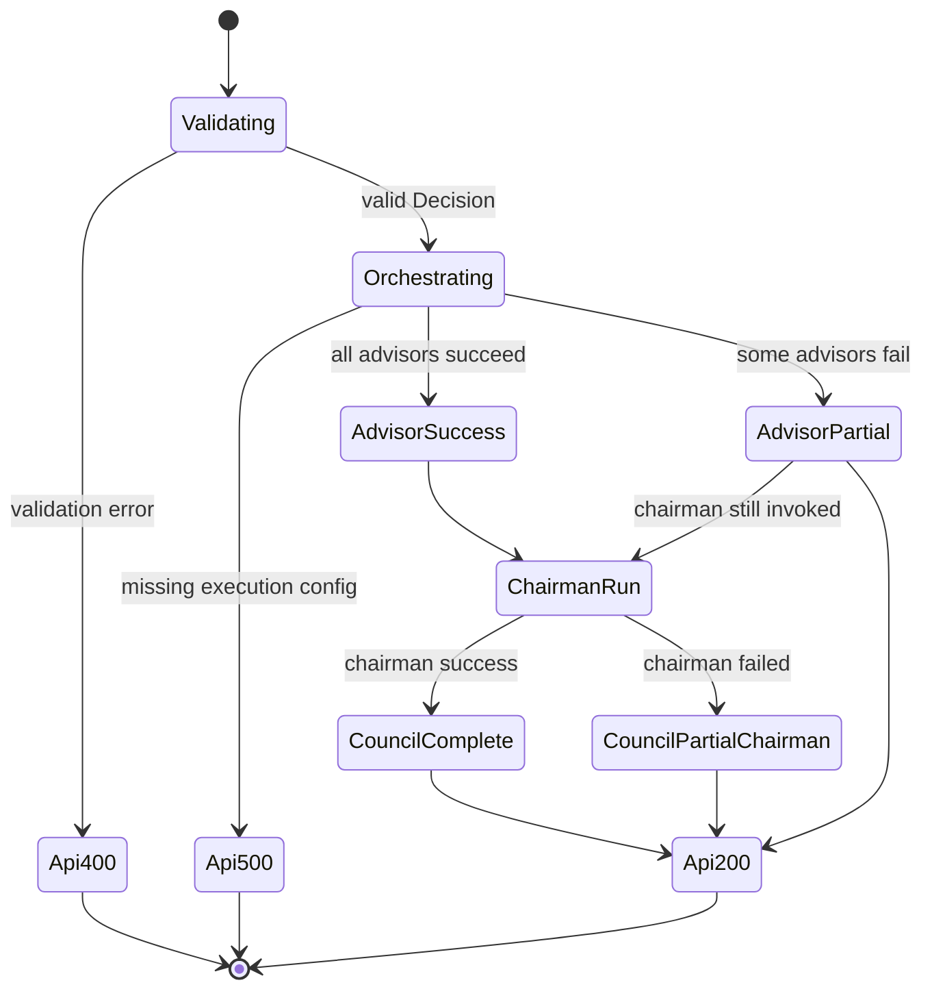

# ENG-0003 — Sprint 1 Execution Architecture

**Status:** Proposed
**Document Type:** Engineering Specification
**Date:** 2026-07-22
**Owner:** Tulio Tavernaro
**Sprint:** Sprint 1
**Related Operations Standard:** OPS-0001 — Engineering Workflow Standard
**Related ADRs:** ADR-0003 — Collective Intelligence Layer; ADR-0005 — Decision Council Advisors v1.0; ADR-0006 — Sprint 1 Architecture Validation Strategy
**Upstream Artifact:** ADR-0006 — Sprint 1 Architecture Validation Strategy
**Downstream Artifacts:** ARR-0002 — Sprint 1 Architecture Readiness Review (future); IMP-0003 — Sprint 1 Implementation Plan (future)
**Target Repository:** `prodignus-council`

---

## 0. Traceability

This specification implements the Sprint 1 execution-validation sequencing defined in ADR-0006.

### 0.1 ADR-0006 to engineering requirements

| ADR-0006 reference | Engineering requirement | ENG section |
| ------------------ | ----------------------- | ----------- |
| §3 Decision — architecture-validation sprint | Define execution architecture to be validated before baseline acceptance | §1, §6, §7 |
| §3 Step 1 — generic Advisor execution | Specify and validate `runAdvisor` pipeline | §9, INV-001, INV-002 |
| §3 Step 2 — generic Chairman execution | Specify and validate `runChairman` pipeline | §10, INV-004, INV-005 |
| §3 Step 3 — orchestration pipeline | Specify and validate `runCouncil` contracts | §11, §13, INV-006 |
| §3 Step 4 — baseline acceptance gate | Certify five-live pipeline only after validation evidence is approved | §16, §17, INV-012 |
| §5 Scope — minimal validation only | Exclude persistence, auth, streaming, deployment | §4 |
| §10 ADR-0005 compatibility | Preserve Advisor v1.0 contracts and routing | §9, §21 |
| §10 ADR-0003 compatibility | Preserve ChairmanContextBuilder integration | §12 |
| §11 Acceptance criteria | Map to ENG acceptance criteria | §23 |

### 0.2 Requirements to invariants

| Requirement | Invariant | Validation evidence |
| ----------- | --------- | ------------------- |
| Generic Advisor execution | INV-001, INV-002, INV-003 | Unit and integration tests per advisor persona |
| Parsed Advisor results before Chairman | INV-003, INV-004 | Parser tests; chairman-context-builder tests |
| Separate Chairman execution | INV-004, INV-005 | `chairman-runner.test.mjs` |
| Orchestrator owns sequencing | INV-006, INV-007 | `orchestrator.integration.test.mjs` |
| Layer separation | INV-008, INV-009, INV-010 | Code structure review; static import boundaries |
| Mock non-evidence | INV-011 | Test fixtures only; no mock runtime path |
| Baseline acceptance gate | INV-012 | Documented validation report before Step 4 baseline certification |

---

## 1. Purpose

This document specifies the **Sprint 1 execution architecture** for the Prodignus Decision Council: the technical contracts, component responsibilities, execution sequence, invariants, and validation evidence required to **certify or reject** the existing Decision Council pipeline as the architectural baseline.

This specification implements ADR-0006. It defines **what must be validated and how components must interact**. It does not authorize implementation to begin without ARR-0002 and IMP-0003 per OPS-0001.

The repository **already implements** a five-live-Advisor execution path with a live Chairman, `DefaultChairmanContextBuilder`, and end-to-end orchestration through `runCouncil`. Sprint 1 does **not** target introduction of five-live execution. Sprint 1 targets production of sufficient evidence to validate the existing architecture. Future execution breadth or feature expansion remains gated by successful validation and Step 4 baseline acceptance per ADR-0006.

---

## 2. Scope

### 2.1 In scope

Sprint 1 execution architecture covers:

* HTTP request intake and validation for council execution;
* `DecisionContext` creation and integrity recording;
* generic Advisor execution through `runAdvisor`;
* persona-specific prompt and parser routing through `advisor-response-router.ts` (frozen per ADR-0005);
* OpenRouter provider invocation through `callOpenRouter`;
* normalized `AdvisorResult[]` collection;
* Chairman context construction through `DefaultChairmanContextBuilder` (ENG-0002);
* Chairman execution through `runChairman`;
* council result assembly through `runCouncil`;
* session status determination through `determineCouncilSessionStatus`;
* failure semantics across all execution layers;
* minimal observability sufficient to prove pipeline behavior;
* validation evidence required before Step 4 baseline acceptance.

### 2.2 Out of scope

This specification does not include:

* persistence or session history;
* authentication or authorization;
* streaming, SSE, or progressive UI updates;
* advanced production observability (tracing platforms, metrics backends);
* UI expansion beyond what is required to trigger validation;
* production deployment hardening;
* collective intelligence capabilities beyond the existing `ChairmanContextBuilder` baseline (ADR-0003 future work);
* Advisor prompt, schema, or parser redesign (ADR-0005 frozen);
* file-by-file implementation tasks (IMP-0003);
* readiness gate decisions (ARR-0002).

---

## 3. Non-goals and deferred scope

| Capability | Status in Sprint 1 | Rationale |
| ---------- | ------------------ | --------- |
| Five-live-Advisor pipeline accepted as architectural baseline | **Deferred until Step 4 gate** | ADR-0006 Step 4; five-live execution already exists in code — acceptance requires validation evidence |
| `AdvisorSource: "mock"` runtime path | **Deferred** | Type exists; no mock runner wired |
| `prototypeMode` / `prototypeAdvisorIds` | **Deferred** | Config fields exist in `councilConfig`; orchestrator ignores them |
| Collective intelligence analysis | **Deferred** | `collectiveIntelligence: {}` in builder |
| Retry loops for provider errors | **Deferred** | `retryable` flag exists; no retry implementation |
| Cost estimation | **Deferred** | Token counts captured; no pricing layer |
| Multimodal attachments in execution | **Deferred** | `DecisionContextAttachment` typed; no upload pipeline |

---

## 4. Current-state architecture

### 4.1 Repository evidence summary

The current repository implements a **live-only server-side execution pipeline** with all five Advisors configured for live execution. No mock advisor templates or mock chairman modules exist under `src/`. The historical baseline described in `DECISION_COUNCIL_ARCHITECTURE_ASSESSMENT.md` (commit `cc90061`) remains valid **historical evidence** for architectural observations at that baseline. Verified current source code supersedes it **only for present-state implementation facts**. Architectural observations in the assessment may remain relevant where not contradicted by current evidence.

### 4.2 Implemented components

| Component | Path | Key symbols | Status |
| --------- | ---- | ----------- | ------ |
| API route | `src/app/api/council/route.ts` | `POST` | **Live** — validates JSON, calls `runCouncil` |
| Request validation | `src/lib/council/validation.ts` | `validateCouncilRequestBody`, `validateDecision`, `DecisionValidationError` | **Live** |
| Orchestrator | `src/lib/council/orchestrator.ts` | `runCouncil`, `resolveAdvisorResult` | **Live** — parallel advisor execution |
| Decision context | `src/lib/council/decision-context.ts` | `createDecisionContext`, `recordDecisionContextIntegrity`, `assertAdvisorPromptIntegrity` | **Live** |
| Advisor runner | `src/lib/council/advisor-runner.ts` | `runAdvisor` | **Live** — generic runner; always sets `source: "live"` |
| Advisor config | `src/lib/council/advisor-execution-config.ts` | `ADVISOR_EXECUTION_CONFIG`, `ADVISOR_EXECUTION_ORDER`, `getAdvisorExecutionConfig` | **Live** — ADV-001..ADV-005 mapped |
| Prompt/parser router | `src/lib/council/advisor-response-router.ts` | `buildAdvisorPromptsForPersona`, `parseAdvisorResponseForPersona`, `mapAdvisorResponseToResultFields` | **Live** — persona routing frozen per ADR-0005 |
| Generic contrarian prompt | `src/lib/council/advisor-prompt.ts` | `buildAdvisorPrompts` | **Live** — ADV-001 default |
| Persona prompts | `src/lib/council/advisors/*-prompt.ts` | `buildProductStrategyPrompts`, etc. | **Live** — ADV-002..005 |
| Generic parser | `src/lib/council/response-parser.ts` | `parseAdvisorResponseContent` | **Live** — ADV-001 |
| Persona parsers | `src/lib/council/advisors/*-response-parser.ts` | persona-specific parsers | **Live** — ADV-002..005 |
| Chairman runner | `src/lib/council/chairman-runner.ts` | `runChairman` | **Live** |
| Chairman context builder | `src/lib/council/chairman-context-builder.ts` | `DefaultChairmanContextBuilder`, `defaultChairmanContextBuilder` | **Live** — implements ENG-0002 |
| Chairman context types | `src/lib/council/chairman-context.types.ts` | `ChairmanContext`, `ChairmanContextBuildInput`, etc. | **Live** |
| Chairman prompts | `src/lib/council/chairman-prompt.ts` | `buildChairmanPrompts` | **Live** — consumes `ChairmanContext` |
| Chairman parser | `src/lib/council/chairman-response-parser.ts` | `parseChairmanResponseContent` | **Live** |
| Chairman config | `src/lib/council/chairman-execution-config.ts` | `CHAIRMAN_MODEL_ENV_VAR` | **Live** |
| Session status | `src/lib/council/council-status.ts` | `determineCouncilSessionStatus` | **Live** |
| OpenRouter client | `src/lib/openrouter/client.ts` | `callOpenRouter` | **Live** |
| Domain types | `src/types/council.ts` | `Decision`, `DecisionContext`, `AdvisorResult`, `ChairmanResult`, `CouncilResult`, etc. | **Live** |
| Persona data | `src/data/advisor-personas.ts` | `advisorPersonas`, `getAdvisorPersonaById` | **Live** |
| Runtime config | `src/config/council.ts` | `councilConfig` | **Live** — `liveAdvisorIds` lists all five IDs |

### 4.3 Static or mock components

| Item | Evidence | Notes |
| ---- | -------- | ----- |
| Mock advisor outputs | **Not present** | No `mock-council-result.ts` or equivalent under `src/` |
| Mock chairman | **Not present** | `runChairman` always invokes OpenRouter |
| `AdvisorSource: "mock"` | **Type only** | Defined in `src/types/council.ts`; never assigned at runtime |
| Prototype config flags | **Unused** | `prototypeMode`, `prototypeAdvisorIds`, `prototypeChairman` in `councilConfig` are not read by orchestrator or runners |

### 4.4 Known gaps

| Gap | Evidence | Sprint 1 impact |
| --- | -------- | --------------- |
| Validation evidence not consolidated | Tests exist (`tests/orchestrator.integration.test.mjs`, advisor/chairman suites) but no Sprint 1 validation report artifact | Step 3 requires documented evidence |
| Five-live baseline vs ADR-0006 gate | `councilConfig.liveAdvisorIds` lists ADV-001..ADV-005; pipeline exists in code | Step 4 certifies baseline — configuration and implementation are not acceptance |
| Missing env vars fail individual advisors | `runAdvisor` returns failed `AdvisorResult` when model env unset | Valid for partial-failure validation; not evidence of full breadth |
| No runtime mock path | Cannot validate mock-to-live transition in production code | Mock-to-live rules apply to test fixtures and future prototype mode only |
| `resolveAdvisorResult` throws on missing config | `orchestrator.ts` line 25–27 | Surfaces as HTTP 500 — distinct from advisor-level graceful failure |
| Assessment document historical | Assessment describes hybrid mock posture at `cc90061` | Valid as historical evidence; current source supersedes for present-state facts only |

### 4.5 Current-state component diagram



---

## 5. Target Sprint 1 execution architecture

Sprint 1 target architecture **preserves the current component boundaries**. Validation work must prove that the existing pipeline satisfies ADR-0006 Steps 1–3. No architectural rewrite is authorized.

### 5.1 Target execution flow

The repository terminology maps to the required conceptual flow as follows:

```text
Council request (CouncilApiRequest)
      │
      ▼
Request validation and normalization (validateCouncilRequestBody → Decision)
      │
      ▼
Council orchestrator (runCouncil)
      │
      ├──► createDecisionContext(decision) ──► DecisionContext
      │
      ├──► Advisor execution mechanism (runAdvisor × N, parallel)
      │       ├── Advisor configuration (getAdvisorExecutionConfig + persona)
      │       ├── prompt construction (buildAdvisorPromptsForPersona)
      │       ├── LLM-provider invocation (callOpenRouter)
      │       ├── response parsing (parseAdvisorResponseForPersona)
      │       ├── contract validation (persona parsers + mapAdvisorResponseToResultFields)
      │       └── normalized AdvisorResult
      │
      ▼
Validated collection of AdvisorResult[] (canonical order: ADVISOR_EXECUTION_ORDER)
      │
      ▼
Chairman context construction (DefaultChairmanContextBuilder.build)
      │
      ▼
Chairman execution mechanism (runChairman)
      │       ├── Chairman prompt construction (buildChairmanPrompts)
      │       ├── LLM-provider invocation (callOpenRouter)
      │       ├── response parsing (parseChairmanResponseContent)
      │       ├── contract validation (chairman-response-parser)
      │       └── normalized ChairmanResult
      │
      ▼
Council result assembly (CouncilResult in runCouncil)
      │
      ▼
Response (CouncilApiSuccess) or controlled failure (CouncilApiFailure)
```

**Naming difference:** The repository uses `Decision` at the API boundary and derives `DecisionContext` inside the orchestrator. This is intentional and preserved.

### 5.2 Target component diagram



Each arrow represents a **contract-bound handoff** that must produce validation evidence in Sprint 1.

---

## 6. End-to-end execution sequence



### 6.1 Sequence rules

1. Validation occurs before orchestration.
2. All advisors in `ADVISOR_EXECUTION_ORDER` are invoked in parallel via `Promise.all`.
3. Chairman executes only when `councilConfig.chairmanEnabled === true`.
4. Chairman receives `DecisionContext` and the full `AdvisorResult[]`, not UI-formatted text.
5. Orchestrator never calls OpenRouter directly.
6. Failed advisor or chairman executions return failed result objects; they do not throw to the API except for orchestrator configuration errors.

---

## 7. Component responsibilities

### 7.1 API route — `src/app/api/council/route.ts`

| Attribute | Specification |
| --------- | ------------- |
| **Responsibility** | HTTP boundary; JSON parsing; delegate to orchestrator |
| **Input** | `Request` with JSON body |
| **Output** | `CouncilApiSuccess` (200) or `CouncilApiFailure` (400/500) |
| **Dependencies** | `validateCouncilRequestBody`, `runCouncil` |
| **Allowed failures** | Invalid JSON → 400; validation error → 400; orchestrator throw → 500 |
| **Prohibited** | Business orchestration; direct provider calls |
| **Status** | Existing and reusable |

### 7.2 Validation — `src/lib/council/validation.ts`

| Attribute | Specification |
| --------- | ------------- |
| **Responsibility** | Validate inbound `Decision` fields |
| **Input** | Unknown JSON body |
| **Output** | `{ decision: Decision }` |
| **Allowed failures** | `DecisionValidationError` |
| **Prohibited** | LLM calls; advisor/chairman logic |
| **Status** | Existing and reusable |

### 7.3 Orchestrator — `src/lib/council/orchestrator.ts`

| Attribute | Specification |
| --------- | ------------- |
| **Responsibility** | Coordinate full council execution and assemble `CouncilResult` |
| **Input** | `Decision` |
| **Output** | `CouncilResult` |
| **Dependencies** | `createDecisionContext`, `runAdvisor`, `runChairman`, `determineCouncilSessionStatus`, `councilConfig` |
| **Allowed failures** | Throws if advisor execution config missing (HTTP 500) |
| **Prohibited** | Prompt construction; provider calls; parsing |
| **Status** | Existing and reusable |

### 7.4 Advisor runner — `src/lib/council/advisor-runner.ts`

| Attribute | Specification |
| --------- | ------------- |
| **Responsibility** | Generic live advisor execution for any configured persona |
| **Input** | `DecisionContext`, `AdvisorPersona`, `AdvisorExecutionConfig` |
| **Output** | `AdvisorResult` (success or failed) |
| **Dependencies** | `advisor-response-router`, `callOpenRouter`, error mappers |
| **Allowed failures** | Returns failed `AdvisorResult`; does not throw for provider/parse failures |
| **Prohibited** | Chairman logic; orchestration of multiple advisors |
| **Status** | Existing and reusable |

### 7.5 Chairman runner — `src/lib/council/chairman-runner.ts`

| Attribute | Specification |
| --------- | ------------- |
| **Responsibility** | Build chairman context, invoke provider, return `ChairmanResult` |
| **Input** | `DecisionContext`, `AdvisorResult[]` |
| **Output** | `ChairmanResult` (success or failed) |
| **Dependencies** | `defaultChairmanContextBuilder`, `buildChairmanPrompts`, `callOpenRouter`, `parseChairmanResponseContent` |
| **Allowed failures** | Returns failed `ChairmanResult` for config, build, provider, and parse errors |
| **Prohibited** | Advisor execution; direct prompt assembly without `ChairmanContext` |
| **Status** | Existing and reusable |

### 7.6 OpenRouter client — `src/lib/openrouter/client.ts`

| Attribute | Specification |
| --------- | ------------- |
| **Responsibility** | HTTP transport to OpenRouter chat completions API |
| **Input** | `CallOpenRouterOptions` |
| **Output** | `OpenRouterCompletionResult` |
| **Allowed failures** | `OpenRouterClientError` with codes: `CONFIGURATION_ERROR`, `PROVIDER_TIMEOUT`, `PROVIDER_ERROR`, `INVALID_PROVIDER_RESPONSE` |
| **Prohibited** | Domain orchestration; parsing advisor/chairman JSON schemas |
| **Status** | Existing and reusable |

### 7.7 ChairmanContextBuilder — `src/lib/council/chairman-context-builder.ts`

| Attribute | Specification |
| --------- | ------------- |
| **Responsibility** | Deterministic assembly of `ChairmanContext` from execution inputs |
| **Input** | `ChairmanContextBuildInput` |
| **Output** | `ChairmanContext` |
| **Allowed failures** | `ChairmanContextBuildError` |
| **Prohibited** | Provider calls; semantic transformation of advisor content |
| **Status** | Existing and reusable — specified by ENG-0002 |

---

## 8. Generic Advisor execution specification

### 8.1 Execution contract

```typescript
// Existing — src/lib/council/advisor-runner.ts
export async function runAdvisor(
  decisionContext: DecisionContext,
  persona: AdvisorPersona,
  config: AdvisorExecutionConfig,
): Promise<AdvisorResult>;
```

### 8.2 Internal pipeline

1. Validate `persona.id === config.advisorId`.
2. Resolve model from `process.env[config.modelEnvVar]`.
3. Build prompts via `buildAdvisorPromptsForPersona(decisionContext, persona)`.
4. Call `callOpenRouter({ model, systemPrompt, userPrompt, temperature: 0.3, timeoutMs: 90000 })`.
5. Parse via `parseAdvisorResponseForPersona(persona.id, content)`.
6. Map to result fields via `mapAdvisorResponseToResultFields`.
7. Return success or failed `AdvisorResult`.

### 8.3 Configuration contract

```typescript
// Existing — src/types/council.ts
export type AdvisorExecutionConfig = {
  advisorId: string;
  modelEnvVar: string;
};
```

Environment mapping (existing — `advisor-execution-config.ts`):

| Advisor ID | Model env var |
| ---------- | ------------- |
| ADV-001 | `OPENROUTER_MODEL_CONTRARIAN` |
| ADV-002 | `OPENROUTER_MODEL_PRODUCT_STRATEGY` |
| ADV-003 | `OPENROUTER_MODEL_UX_ACCESSIBILITY` |
| ADV-004 | `OPENROUTER_MODEL_DELIVERY_ENGINEERING` |
| ADV-005 | `OPENROUTER_MODEL_HUMAN_IMPACT` |

Shared requirement: `OPENROUTER_API_KEY`.

### 8.4 Persona routing (ADR-0005 frozen)

Advisor-specific behavior is **configuration and routing driven**, not implemented through duplicated runners:

| Advisor ID | Prompt builder | Parser |
| ---------- | -------------- | ------ |
| ADV-001 | `buildAdvisorPrompts` | `parseAdvisorResponseContent` |
| ADV-002 | `buildProductStrategyPrompts` | `parseProductStrategyResponseContent` |
| ADV-003 | `buildUxAccessibilityPrompts` | `parseUxAccessibilityResponseContent` |
| ADV-004 | `buildDeliveryEngineeringPrompts` | `parseDeliveryEngineeringResponseContent` |
| ADV-005 | `buildHumanImpactPrompts` | `parseHumanImpactResponseContent` |

Routing is centralized in `advisor-response-router.ts`. Sprint 1 must not split this into per-advisor runners.

### 8.5 Component disposition

| Piece | Disposition |
| ----- | ----------- |
| `runAdvisor` | Existing and reusable |
| `advisor-response-router.ts` | Existing and reusable (frozen routing) |
| Persona prompt/parser modules | Existing and reusable (ADR-0005) |
| Mock advisor path | Missing and deferred |

---

## 9. Generic Chairman execution specification

### 9.1 Execution contract

```typescript
// Existing — src/lib/council/chairman-runner.ts
export async function runChairman(
  decisionContext: DecisionContext,
  advisors: AdvisorResult[],
): Promise<ChairmanResult>;
```

### 9.2 Internal pipeline

1. Resolve model from `process.env[OPENROUTER_MODEL_CHAIRMAN]`.
2. Build context: `defaultChairmanContextBuilder.build({ decisionContext, advisors })`.
3. Build prompts: `buildChairmanPrompts(chairmanContext)`.
4. Call `callOpenRouter`.
5. Parse: `parseChairmanResponseContent(completion.content)`.
6. Map to `ChairmanResult` (confidence scaled from 0–100 to 0–1).

### 9.3 Chairman input contract

Chairman execution input is the **composite of**:

* `DecisionContext` — decision fields and execution metadata;
* `AdvisorResult[]` — complete normalized advisor outputs including failed advisors.

The Chairman must not consume raw provider JSON or UI-rendered card text.

### 9.4 Component disposition

| Piece | Disposition |
| ----- | ----------- |
| `runChairman` | Existing and reusable |
| `DefaultChairmanContextBuilder` | Existing and reusable (ENG-0002) |
| `buildChairmanPrompts` | Existing and reusable |
| `parseChairmanResponseContent` | Existing and reusable |
| Mock chairman path | Not present; deferred |

---

## 10. Council orchestrator specification

### 10.1 Execution contract

```typescript
// Existing — src/lib/council/orchestrator.ts
export async function runCouncil(decision: Decision): Promise<CouncilResult>;
```

### 10.2 Assembly rules

The orchestrator produces:

```typescript
// Existing — src/types/council.ts
export type CouncilResult = {
  decision: Decision;
  decisionContext: DecisionContext;
  integrity: CouncilIntegrityDiagnostics;
  status: CouncilSessionStatus;
  advisors: AdvisorResult[];
  chairman?: ChairmanResult;
  totalDurationMs: number;
};
```

### 10.3 Session status semantics

`determineCouncilSessionStatus(advisors, liveAdvisorIds, minimumSuccessfulAdvisors)`:

| Condition | Status |
| --------- | ------ |
| No live-listed advisor failed | `"complete"` |
| Any live-listed advisor failed AND successful count ≥ minimum | `"partial"` |
| Any live-listed advisor failed AND successful count < minimum | `"failed"` |

Current config: `minimumSuccessfulAdvisors: 3`, `liveAdvisorIds` = ADV-001..ADV-005.

**Note:** Status logic keys off `liveAdvisorIds`, not `AdvisorResult.source`. All results currently have `source: "live"`.

### 10.4 Concurrency

Advisor execution uses `Promise.all` over `ADVISOR_EXECUTION_ORDER`. Chairman executes after all advisor promises settle. Sprint 1 preserves this parallel-advisor, sequential-chairman pattern.

### 10.5 Component disposition

| Piece | Disposition |
| ----- | ----------- |
| `runCouncil` | Existing and reusable |
| `determineCouncilSessionStatus` | Existing and reusable |
| Orchestrator throw on missing config | Existing behavior — document in IMP-0003 whether to align with advisor graceful failure |

---

## 11. ChairmanContextBuilder relationship

### 11.1 Usage in Sprint 1

`DefaultChairmanContextBuilder` is **used directly** by `runChairman`. It is not optional in the live chairman path.

```text
DecisionContext + AdvisorResult[]
      │
      ▼
DefaultChairmanContextBuilder.build()
      │
      ▼
ChairmanContext (schemaVersion "1.0")
      │
      ▼
buildChairmanPrompts(chairmanContext)
      │
      ▼
callOpenRouter → parseChairmanResponseContent → ChairmanResult
```

### 11.2 Stable contracts (ENG-0002)

Sprint 1 must preserve ENG-0002 contracts without modification unless a separate approved ENG revision exists:

* `ChairmanContextBuildInput`
* `ChairmanContext`
* `ChairmanContextBuilder` interface
* `ChairmanContextBuildError` taxonomy
* `collectiveIntelligence: {}` placeholder

### 11.3 Avoiding duplication with ENG-0002

ENG-0003 specifies **where** the builder sits in the Sprint 1 execution pipeline and **what validation evidence** must prove it operates correctly.

ENG-0003 does **not** redefine:

* field mapping tables (ENG-0002 §9);
* builder invariants INV-001 through INV-010 (ENG-0002 §8);
* builder unit test cases (ENG-0002 §15).

Cross-reference rule: Sprint 1 validation must include existing `tests/chairman-context-builder.test.mjs` and chairman pipeline tests as evidence for Step 2.

---

## 12. Domain contracts and schemas

All canonical types reside in `src/types/council.ts` unless noted.

### 12.1 Council request

| Contract | Type | Entry point |
| -------- | ---- | ----------- |
| HTTP envelope | `CouncilApiRequest` | `{ decision: Decision }` |
| Decision input | `Decision` | Client-provided id, title, question, context, constraints, createdAt, status |
| Form request (UI) | `CouncilRequest` | Subset used by UI before Decision assembly |

### 12.2 Advisor execution input

| Contract | Type | Source |
| -------- | ---- | ------ |
| Execution state | `DecisionContext` | `createDecisionContext(decision)` |
| Persona | `AdvisorPersona` | `getAdvisorPersonaById` |
| Config | `AdvisorExecutionConfig` | `getAdvisorExecutionConfig` |

### 12.3 Advisor result

```typescript
export type AdvisorResult = {
  persona: AdvisorPersona;
  source: AdvisorSource; // "live" | "mock" — runtime uses "live" only
  status: AdvisorStatus; // "success" | "failed" (also "idle" | "running" unused at rest)
  executionId: string;
  summary: string;
  analysis: AdvisorAnalysisItem[];
  assumptions: string[];
  risks: string[];
  recommendation: CouncilDecision;
  confidence: number;
  // optional persona-specific fields ...
  durationMs: number;
  totalTokens: number;
  errorMessage?: string;
};
```

### 12.4 Advisor collection

* Type: `AdvisorResult[]`
* Order: `ADVISOR_EXECUTION_ORDER` (ADV-001 → ADV-005)
* Partial failures: array includes failed entries with `status: "failed"`

### 12.5 Chairman execution input

| Contract | Type | Notes |
| -------- | ---- | ----- |
| Build input | `ChairmanContextBuildInput` | `chairman-context.types.ts` |
| Structured context | `ChairmanContext` | Consumed by prompt builder |

### 12.6 Chairman result

```typescript
export type ChairmanResult = {
  status: ChairmanStatus;
  executionId: string;
  decision: CouncilDecision;
  executiveSummary: string;
  finalRecommendation: string;
  consensus: string[];
  disagreements: string[];
  keyArguments: string[];
  risks: string[];
  conditions: string[];
  nextSteps: string[];
  confidence: number;
  durationMs: number;
  totalTokens: number;
  errorMessage?: string;
};
```

### 12.7 Final council response

| Contract | Type | Transport |
| -------- | ---- | --------- |
| Success | `CouncilApiSuccess` | `{ ok: true, result: CouncilResult }` |
| Failure | `CouncilApiFailure` | `{ ok: false, error: { code, message, retryable } }` |

### 12.8 Validation outcomes

| Layer | Success signal | Failure signal |
| ----- | -------------- | -------------- |
| HTTP validation | Proceed to orchestrator | 400 `INVALID_REQUEST` |
| Advisor | `AdvisorResult.status === "success"` | `status === "failed"` + `errorMessage` |
| Chairman context build | `ChairmanContext` returned | `ChairmanContextBuildError` → failed chairman |
| Chairman execution | `ChairmanResult.status === "success"` | `status === "failed"` + `errorMessage` |
| Council session | `CouncilSessionStatus` derived | `"partial"` or `"failed"` |

### 12.9 Proposed contract — Sprint 1 validation record (future artifact)

Not yet implemented. Required semantic fields for downstream IMP-0003 / validation reporting:

* `executionId`
* `validationStep` (1 | 2 | 3 | 4)
* `evidenceType` (unit | integration | manual)
* `passFail`
* `timestamp`
* `notes`

This is a **proposed contract** for validation documentation, not a runtime TypeScript type in the current repository.

---

## 13. Execution invariants

Each invariant was evaluated against the current repository before being marked binding for Sprint 1.

| ID | Invariant | Current evidence | Sprint 1 binding |
| -- | --------- | ---------------- | ---------------- |
| **INV-001** | Every live Advisor uses the same generic `runAdvisor` mechanism | Single runner in `advisor-runner.ts` | **Yes** |
| **INV-002** | Advisor-specific behavior is configuration or prompt/parser routed, not duplicate runners | `advisor-response-router.ts` | **Yes** |
| **INV-003** | Every Advisor result is parsed and contract-validated before Chairman consumption | Parsers invoked in `runAdvisor` before return | **Yes** |
| **INV-004** | Chairman consumes normalized `AdvisorResult[]`, not UI text | `runChairman(decisionContext, advisors)` | **Yes** |
| **INV-005** | Chairman execution is separate from Advisor execution but shares `callOpenRouter` | Separate runners | **Yes** |
| **INV-006** | Orchestration owns execution order and result assembly | `runCouncil` exclusively coordinates | **Yes** |
| **INV-007** | Prompt builders do not call providers | No provider imports in prompt modules | **Yes** |
| **INV-008** | Provider client does not contain domain orchestration | `client.ts` is transport-only | **Yes** |
| **INV-009** | Parsers do not perform provider calls | Parser modules are pure | **Yes** |
| **INV-010** | Mock results cannot be treated as evidence of live execution validity | No mock runtime path | **Yes** |
| **INV-011** | Partial failure behavior is explicit and deterministic | Failed results + `determineCouncilSessionStatus` | **Yes** |
| **INV-012** | The current five-live-Advisor configuration shall not be considered an accepted architectural baseline until required validation evidence is produced and approved | Five-live path exists in code and config; ADR-0006 Step 4 is a governance acceptance gate, not a configuration switch | **Yes** |
| **INV-013** | No persistence, streaming, auth, or deployment redesign unless minimally required | Not present in pipeline | **Yes** |
| **INV-014** | ChairmanContextBuilder pipeline preserved per ENG-0002 | Wired in `runChairman` | **Yes** |

---

## 14. Failure semantics

### 14.1 Provider failure

| Stage | Behavior | User-visible signal |
| ----- | -------- | ------------------- |
| Advisor | `OpenRouterClientError` mapped → failed `AdvisorResult` | `errorMessage` on advisor; HTTP 200 with partial/complete council |
| Chairman | `OpenRouterClientError` → failed `ChairmanResult` | `chairman.errorMessage`; HTTP 200 |
| Missing API key | `CONFIGURATION_ERROR` → failed result | Safe configuration message |

### 14.2 Timeout

* Provider timeout: `PROVIDER_TIMEOUT` via `AbortController` (90s default).
* Advisor and chairman return failed results; council may still return 200.

### 14.3 Malformed provider response

* `INVALID_PROVIDER_RESPONSE` from client → failed advisor/chairman result.

### 14.4 Parser failure

* `InvalidModelOutputError` / persona parse errors → failed advisor result with `safeMessage`.
* `ChairmanModelOutputParseError` → failed chairman result.

### 14.5 Contract validation failure

Handled inside persona parsers before `AdvisorResult` assembly. Chairman schema validation in `parseChairmanResponseContent`.

### 14.6 Missing advisor result

Not applicable at orchestrator level — array always contains five entries. Failed execution still produces a failed `AdvisorResult` placeholder.

### 14.7 Chairman failure

Chairman failure does not change HTTP status to 500. Council returns with `chairman.status === "failed"`. Session status is driven by advisor outcomes, not chairman status.

### 14.8 Partial execution

When some advisors fail:

* `CouncilSessionStatus` may be `"partial"` or `"failed"`.
* Chairman still executes if enabled, receiving failed advisor entries in context.
* Prompt builder renders failed advisor sections from `ChairmanContext`.

### 14.9 Unexpected internal failure

* Missing advisor execution config in orchestrator → throws → API 500 `INTERNAL_ERROR`.
* Unexpected throw from `runCouncil` → API 500.

### 14.10 Failure-path diagram



---

## 15. Mock-to-live transition rules

### 15.1 Current state

No runtime mock-to-live transition exists. All execution paths are live.

### 15.2 Binding rules for Sprint 1

1. **Test fixtures** may simulate provider responses (see `tests/orchestrator.integration.test.mjs`). Fixture data is not production execution evidence.
2. **`AdvisorSource: "mock"`** must not be assigned unless a future approved implementation introduces an explicit mock runner.
3. **Prototype config flags** must not be activated in Sprint 1 validation without a new ADR or ENG revision.
4. **Step 4 baseline acceptance** requires documented validation evidence for each advisor ID individually before the five-live-Advisor pipeline may be certified as the architectural baseline.
5. Replacing test mocks with live env configuration is an **operational** concern for IMP-0003, not an architectural redesign.

---

## 16. Validation evidence required

Sprint 1 Steps 1–3 are complete only when the following evidence exists:

### Step 1 — Generic Advisor execution

| Evidence | Existing artifact |
| -------- | ----------------- |
| Single runner executes all personas | `advisor-runner.ts` + `advisor-response-router.ts` |
| Per-persona parser tests | `tests/*-response-parser.test.mjs`, `tests/*-advisor.test.mjs` |
| Contrarian reliability | `tests/contrarian-reliability.test.mjs` |
| Structured output discipline | `tests/advisor-structured-output-discipline.test.mjs` |

### Step 2 — Generic Chairman execution

| Evidence | Existing artifact |
| -------- | ----------------- |
| Context builder tests | `tests/chairman-context-builder.test.mjs` |
| Prompt builder tests | `tests/chairman-prompt.test.mjs` |
| Chairman runner tests | `tests/chairman-runner.test.mjs` |
| Chairman parser tests | `tests/chairman-response-parser.test.mjs` |

### Step 3 — Complete orchestration pipeline

| Evidence | Existing artifact |
| -------- | ----------------- |
| End-to-end orchestrator integration | `tests/orchestrator.integration.test.mjs` |
| Session status rules | `tests/council-status.test.mjs` |
| Decision context integrity | `tests/decision-context-integrity.test.mjs` |

### Step 4 gate — Baseline acceptance (future)

Requires a documented validation report confirming live execution evidence for ADV-001 through ADV-005 individually. Existing implementation and configuration alone are insufficient to certify the five-live-Advisor pipeline as the architectural baseline.

---

## 17. Observability required for Sprint 1

Minimal evidence only:

| Signal | Current mechanism | Sprint 1 requirement |
| ------ | ----------------- | -------------------- |
| Advisor parse failure | `console.error` in `advisor-runner.ts` | Preserve; sufficient for validation |
| Execution duration | `durationMs` on results | Must appear in `CouncilResult` |
| Token usage | `totalTokens` on results | Must appear in results |
| Integrity digest | `CouncilIntegrityDiagnostics` | Must be populated in `CouncilResult` |
| Structured logging platform | Not present | **Not required** |
| Correlation IDs | Not present | **Not required** |
| Cost metrics | Not present | **Deferred** |

---

## 18. Security and data-handling considerations

| Concern | Current behavior | Sprint 1 requirement |
| ------- | ---------------- | -------------------- |
| API key exposure | `server-only` on council and openrouter modules | Preserve |
| Provider errors | Sanitized to 500 chars | Preserve |
| Advisor safe messages | `toAdvisorSafeMessage` | Preserve |
| Authentication | Not implemented | **Deferred** |
| Request logging | Not implemented | Do not add full prompt logging in Sprint 1 |
| PII in logs | Parse errors log advisor id/name only | Preserve minimal logging |

---

## 19. Performance and concurrency considerations

| Topic | Current behavior | Sprint 1 rule |
| ----- | ---------------- | ------------- |
| Advisor concurrency | `Promise.all` — five parallel calls | Preserve; do not serialize unless validation proves instability |
| Chairman timing | Sequential after advisors complete | Preserve |
| Timeout | 90s per provider call | Document; changing requires IMP-0003 |
| Serverless limits | Not evaluated in repo | Open question for ARR-0002 if deployment target known |

---

## 20. Compatibility constraints

1. **ADR-0005:** No changes to advisor prompts, schemas, parser architecture, or routing except bug fixes.
2. **ADR-0003 / ENG-0002:** ChairmanContextBuilder contracts and pipeline position preserved.
3. **ADR-0006:** Validation sequencing overrides breadth-first delivery from the architecture assessment Phase 1 recommendation.
4. **OPS-0001:** This ENG does not authorize implementation without ARR-0002 and IMP-0003.
5. **ENG-0002:** Sprint 1 must not regress chairman context builder behavior certified in AIR-0001 / ICR-0002.

---

## 21. Prohibited changes

Sprint 1 implementation governed by this specification must **not**:

* rewrite orchestrator, runner, or provider architecture;
* merge advisor and chairman runners;
* embed provider calls in prompt or parser modules;
* embed Advisor results in `DecisionContext`;
* activate mock/prototype mode without new governance approval;
* expand collective intelligence beyond existing builder placeholder;
* add persistence, authentication, streaming, or deployment infrastructure;
* treat configuration or existence of the five-live-Advisor execution path as proof of baseline acceptance;
* modify ADR-0005 frozen advisor contracts for feature convenience.

---

## 22. Acceptance criteria

Sprint 1 execution architecture is accepted when:

1. **Step 1 proven:** Evidence demonstrates all five personas execute through `runAdvisor` with parsed `AdvisorResult` outputs (tests or documented live runs per persona).
2. **Step 2 proven:** Evidence demonstrates `runChairman` consumes `AdvisorResult[]` through `ChairmanContextBuilder` and returns parsed `ChairmanResult`.
3. **Step 3 proven:** Evidence demonstrates `runCouncil` end-to-end assembly with correct `CouncilSessionStatus`, integrity diagnostics, and failure semantics.
4. **Invariants:** INV-001 through INV-014 satisfied without architectural rewrite.
5. **Compatibility:** ADR-0005, ADR-0003, ENG-0002 contracts preserved.
6. **Step 4 gate:** Five-live-Advisor baseline acceptance documented separately; not implied by existing implementation or this ENG alone.
7. **Traceability:** Validation evidence mapped to ADR-0006 acceptance criteria.

---

## 23. Traceability

```text
OPS-0001 (workflow)
      │
      ▼
ADR-0003 (Collective Intelligence Layer — long-term architecture)
      │
      ▼
ADR-0005 (Decision Council Advisors v1.0 — Advisor architecture baseline)
      │
      ▼
ADR-0006 (Sprint 1 Architecture Validation Strategy)
      │
      ▼
ENG-0003 (Sprint 1 Execution Architecture) ← this document
      │
      ▼
ARR-0002 (Sprint 1 Architecture Readiness Review — future)
      │
      ▼
IMP-0003 (Sprint 1 Implementation Plan — future)
      │
      ▼
Implementation
      │
      ▼
AIR / ICR (future)
```

---

## 24. References

| Reference | Role |
| --------- | ---- |
| [OPS-0001 — Engineering Workflow Standard](../ops/OPS-0001-engineering-workflow-standard.md) | Governance and artifact boundaries |
| [ADR-0003 — Collective Intelligence Layer](../adr/ADR-0003-collective-intelligence-layer.md) | Collective intelligence and ChairmanContextBuilder direction |
| [ADR-0005 — Decision Council Advisors v1.0](../adr/ADR-0005-decision-council-advisors-v1.md) | Advisor layer stability baseline |
| [ADR-0006 — Sprint 1 Architecture Validation Strategy](../adr/ADR-0006-sprint-1-architecture-validation-strategy.md) | Canonical Sprint 1 sequencing decision |
| [ENG-0002 — ChairmanContextBuilder Technical Specification](./ENG-0002-chairman-context-builder-technical-specification.md) | Chairman context builder contract |
| [ARR-0001 — Architecture Readiness Review](../arr/ARR-0001-architecture-readiness-review.md) | Prior readiness patterns |
| [IMP-0002 — ChairmanContextBuilder Implementation Plan](../imp/IMP-0002-chairman-context-builder-implementation-plan.md) | Prior implementation plan patterns |
| [AIR-0001 — Architecture Implementation Review](../air/AIR-0001-chairman-context-builder-architecture-implementation-review.md) | ChairmanContextBuilder compliance evidence |
| [ICR-0002 — Implementation Completion Report](../icr/ICR-0002-chairman-context-builder-implementation-completion-report.md) | ChairmanContextBuilder delivery evidence |
| [DECISION_COUNCIL_ARCHITECTURE_ASSESSMENT.md](../../DECISION_COUNCIL_ARCHITECTURE_ASSESSMENT.md) | Historical architecture assessment (baseline commit `cc90061`) |

---

## 25. Open questions requiring resolution in ARR-0002 or IMP-0003

| ID | Question | Default until resolved |
| -- | -------- | ---------------------- |
| **OQ-001** | Does Sprint 1 validation require live OpenRouter runs for all five advisors, or are mocked-provider integration tests sufficient for architectural proof? | Mocked integration tests prove pipeline structure; live runs prove operational readiness — ARR must decide minimum bar |
| **OQ-002** | For isolated validation, does ARR-0002 require temporary test-environment control (for example, subset invocation in tests) without redefining the production five-live-Advisor architecture? | Production architecture remains five-live; ARR-0002 decides whether isolated validation needs test-only controls — ENG-0003 does not prescribe configuration changes |
| **OQ-003** | Should orchestrator throw on missing execution config be aligned with advisor graceful failure? | Existing throw → 500 behavior preserved unless IMP explicitly changes |
| **OQ-004** | What constitutes the formal Step 4 baseline acceptance artifact? | Proposed: validation report referenced from ICR or standalone ops doc |
| **OQ-005** | Is deployment target (serverless vs long-running) relevant to timeout validation in Sprint 1? | Deferred unless deployment is in minimal validation path |
| **OQ-006** | Should unused prototype config flags be removed or documented as reserved? | Deferred — document only in IMP-0003 |
| **OQ-007** | Does chairman failure affect session status in future, or remain advisor-only? | Current: advisor-only — preserve unless new ADR |
| **OQ-008** | Required env var matrix for CI validation environments? | IMP-0003 defines test environment contract |

---

## 26. Related Documentation

- [OPS-0001 — Engineering Workflow Standard](../ops/OPS-0001-engineering-workflow-standard.md)
- [ADR-0006 — Sprint 1 Architecture Validation Strategy](../adr/ADR-0006-sprint-1-architecture-validation-strategy.md)
- [ENG-0002 — ChairmanContextBuilder Technical Specification](./ENG-0002-chairman-context-builder-technical-specification.md)
- [Documentation Index](../README.md)
